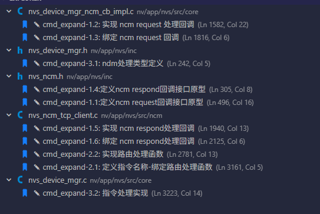

## 流程

从序号133开始新增

```c++
typedef enum {
    /* 通用文件操作 (fs_ops) */
    NVS_NDM_NCM_REQ_FS_CAP_QUERY = 133,         /* 查询设备文件服务能力 */
    NVS_NDM_NCM_REQ_FS_STAT = 134,              /* 查询单个文件详细状态 */
    NVS_NDM_NCM_REQ_FS_LIST = 135,              /* 遍历指定目录下的文件列表 */
    NVS_NDM_NCM_REQ_FS_FILE_READ_OPEN = 136,    /* 打开文件用于读取 (导出) */
    NVS_NDM_NCM_REQ_FS_FILE_READ_DATA = 137,    /* 分片读取文件数据 */
    NVS_NDM_NCM_REQ_FS_FILE_WRITE_OPEN = 138,   /* 打开文件用于写入 (导入) */
    NVS_NDM_NCM_REQ_FS_FILE_WRITE_DATA = 139,   /* 分片写入文件数据 */
    NVS_NDM_NCM_REQ_FS_CLOSE = 140,             /* 结束文件读写会话并释放资源 */
    NVS_NDM_NCM_REQ_FS_DELETE = 141,            /* 删除指定路径的文件或目录 */
    NVS_NDM_NCM_REQ_FS_MKDIR = 142,             /* 在指定路径创建新目录 */
} nvs_ndm_ncm_request_type_e;
```

## 注释标记

```c++
//TODO: jfxu temp_add: 20260407
```

### 1. 定义 NCM 请求处理回调接口原型

* **文件位置:** `nv/app/nvs/inc/nvs_ncm.h`
* **说明:** 除了 `FILE_SVC_WRITE_DATA` 需要接收上位机发来的二进制文件块，其余均为纯 JSON 请求。

```c
typedef struct {
    // ... 现有回调 ...

    // --- 文件传输服务 (FILE_SVC) 请求处理回调 ---
    nvs_ncm_ret_t (*on_file_svc_cap_query_request)(nvs_ncm_session_t *session, int32_t resp_body_type, void *user_arg, const void *req_jobj, void *resp_jobj);
    nvs_ncm_ret_t (*on_file_svc_stat_request)(nvs_ncm_session_t *session, int32_t resp_body_type, void *user_arg, const void *req_jobj, void *resp_jobj);
    nvs_ncm_ret_t (*on_file_svc_list_request)(nvs_ncm_session_t *session, int32_t resp_body_type, void *user_arg, const void *req_jobj, void *resp_jobj);
    nvs_ncm_ret_t (*on_file_svc_read_open_request)(nvs_ncm_session_t *session, int32_t resp_body_type, void *user_arg, const void *req_jobj, void *resp_jobj);
    nvs_ncm_ret_t (*on_file_svc_read_data_request)(nvs_ncm_session_t *session, int32_t resp_body_type, void *user_arg, const void *req_jobj, void *resp_jobj);
    nvs_ncm_ret_t (*on_file_svc_write_open_request)(nvs_ncm_session_t *session, int32_t resp_body_type, void *user_arg, const void *req_jobj, void *resp_jobj);
    
    // 注意：带有二进制负载的请求，需要额外传递二进制指针和长度
    nvs_ncm_ret_t (*on_file_svc_write_data_request)(nvs_ncm_session_t *session, const uint8_t *bin_data, uint32_t bin_len, int32_t resp_body_type, void *user_arg, const void *req_jobj, void *resp_jobj);
    
    nvs_ncm_ret_t (*on_file_svc_close_request)(nvs_ncm_session_t *session, int32_t resp_body_type, void *user_arg, const void *req_jobj, void *resp_jobj);
    nvs_ncm_ret_t (*on_file_svc_delete_request)(nvs_ncm_session_t *session, int32_t resp_body_type, void *user_arg, const void *req_jobj, void *resp_jobj);
    nvs_ncm_ret_t (*on_file_svc_mkdir_request)(nvs_ncm_session_t *session, int32_t resp_body_type, void *user_arg, const void *req_jobj, void *resp_jobj);

} nvs_ncm_callback_t;
```

---

### 2. 定义 NCM 响应处理回调接口原型

* **文件位置:** `nv/app/nvs/inc/nvs_ncm.h`
* **说明:** 除了 `FILE_SVC_READ_DATA` 需要向下位机发送二进制文件块，其余均为纯 JSON 响应。

```c
typedef struct {
    // ... 现有 ops ...

    // --- 文件传输服务 (FILE_SVC) 响应处理回调 ---
    void (*do_file_svc_cap_query_respond)(nvs_ncm_session_t *session, const void *req_jobj, const void *resp_jobj);
    void (*do_file_svc_stat_respond)(nvs_ncm_session_t *session, const void *req_jobj, const void *resp_jobj);
    void (*do_file_svc_list_respond)(nvs_ncm_session_t *session, const void *req_jobj, const void *resp_jobj);
    void (*do_file_svc_read_open_respond)(nvs_ncm_session_t *session, const void *req_jobj, const void *resp_jobj);
    
    // 注意：带有二进制负载的响应，需要额外传递二进制指针和长度
    void (*do_file_svc_read_data_respond)(nvs_ncm_session_t *session, const uint8_t *bin_data, uint32_t bin_len, const void *req_jobj, const void *resp_jobj);
    
    void (*do_file_svc_write_open_respond)(nvs_ncm_session_t *session, const void *req_jobj, const void *resp_jobj);
    void (*do_file_svc_write_data_respond)(nvs_ncm_session_t *session, const void *req_jobj, const void *resp_jobj);
    void (*do_file_svc_close_respond)(nvs_ncm_session_t *session, const void *req_jobj, const void *resp_jobj);
    void (*do_file_svc_delete_respond)(nvs_ncm_session_t *session, const void *req_jobj, const void *resp_jobj);
    void (*do_file_svc_mkdir_respond)(nvs_ncm_session_t *session, const void *req_jobj, const void *resp_jobj);

} nvs_ncm_ops_t; 
```

---

### 3. 实现 NCM 请求处理回调

* **文件位置:** `nv/app/nvs/src/core/nvs_device_mgr_ncm_cb_impl.c`

```c
// 示例1：纯 JSON 请求 (以 FILE_SVC_LIST 为例)
// static nvs_ncm_ret_t on_file_svc_list_request(nvs_ncm_session_t *session, int32_t resp_body_type, void *user_arg, const void *req_jobj, void *resp_jobj)
// {
//     nvs_device_mgr_t *device_mgr = (nvs_device_mgr_t *)user_arg;
//     send_ndm_ncm_request_to_main_thread(device_mgr, NVS_NDM_NCM_REQ_FILE_SVC_LIST,
//                                         session, resp_body_type, req_jobj, resp_jobj,
//                                         NULL, 0);
//     return 0;
// }

// 示例2：混合负载请求 (以 FILE_SVC_WRITE_DATA 为例，需传递二进制流)
// static nvs_ncm_ret_t on_file_svc_write_data_request(nvs_ncm_session_t *session, const uint8_t *bin_data, uint32_t bin_len, int32_t resp_body_type, void *user_arg, const void *req_jobj, void *resp_jobj)
// {
//     nvs_device_mgr_t *device_mgr = (nvs_device_mgr_t *)user_arg;
//     // 注意：底层发送到主线程的函数需要支持传递 bin_data 和 bin_len
//     send_ndm_ncm_request_to_main_thread(device_mgr, NVS_NDM_NCM_REQ_FILE_SVC_WRITE_DATA,
//                                         session, resp_body_type, req_jobj, resp_jobj,
//                                         (void*)bin_data, bin_len); 
//     return 0;
// }

static nvs_ncm_ret_t on_file_svc_cap_query_request(nvs_ncm_session_t *session, int32_t resp_body_type, void *user_arg, const void *req_jobj, void *resp_jobj) {
    send_ndm_ncm_request_to_main_thread((nvs_device_mgr_t *)user_arg, NVS_NDM_NCM_REQ_FILE_SVC_CAP_QUERY, session, resp_body_type, req_jobj, resp_jobj, NULL, 0);
    return 0;
}

static nvs_ncm_ret_t on_file_svc_stat_request(nvs_ncm_session_t *session, int32_t resp_body_type, void *user_arg, const void *req_jobj, void *resp_jobj) {
    send_ndm_ncm_request_to_main_thread((nvs_device_mgr_t *)user_arg, NVS_NDM_NCM_REQ_FILE_SVC_STAT, session, resp_body_type, req_jobj, resp_jobj, NULL, 0);
    return 0;
}

static nvs_ncm_ret_t on_file_svc_list_request(nvs_ncm_session_t *session, int32_t resp_body_type, void *user_arg, const void *req_jobj, void *resp_jobj) {
    send_ndm_ncm_request_to_main_thread((nvs_device_mgr_t *)user_arg, NVS_NDM_NCM_REQ_FILE_SVC_LIST, session, resp_body_type, req_jobj, resp_jobj, NULL, 0);
    return 0;
}

static nvs_ncm_ret_t on_file_svc_read_open_request(nvs_ncm_session_t *session, int32_t resp_body_type, void *user_arg, const void *req_jobj, void *resp_jobj) {
    send_ndm_ncm_request_to_main_thread((nvs_device_mgr_t *)user_arg, NVS_NDM_NCM_REQ_FILE_SVC_READ_OPEN, session, resp_body_type, req_jobj, resp_jobj, NULL, 0);
    return 0;
}

static nvs_ncm_ret_t on_file_svc_read_data_request(nvs_ncm_session_t *session, int32_t resp_body_type, void *user_arg, const void *req_jobj, void *resp_jobj) {
    send_ndm_ncm_request_to_main_thread((nvs_device_mgr_t *)user_arg, NVS_NDM_NCM_REQ_FILE_SVC_READ_DATA, session, resp_body_type, req_jobj, resp_jobj, NULL, 0);
    return 0;
}

static nvs_ncm_ret_t on_file_svc_write_open_request(nvs_ncm_session_t *session, int32_t resp_body_type, void *user_arg, const void *req_jobj, void *resp_jobj) {
    send_ndm_ncm_request_to_main_thread((nvs_device_mgr_t *)user_arg, NVS_NDM_NCM_REQ_FILE_SVC_WRITE_OPEN, session, resp_body_type, req_jobj, resp_jobj, NULL, 0);
    return 0;
}

// 注意这个回调带有 bin_data 和 bin_len
static nvs_ncm_ret_t on_file_svc_write_data_request(nvs_ncm_session_t *session, const uint8_t *bin_data, uint32_t bin_len, int32_t resp_body_type, void *user_arg, const void *req_jobj, void *resp_jobj) {
    // TEMP_XJF: 假设底层接口的最后两个参数是用来传递额外数据(额外指针, 额外长度)的，请根据实际参数名修改
    send_ndm_ncm_request_to_main_thread((nvs_device_mgr_t *)user_arg, NVS_NDM_NCM_REQ_FILE_SVC_WRITE_DATA, session, resp_body_type, req_jobj, resp_jobj, (void*)bin_data, bin_len);
    return 0;
}

static nvs_ncm_ret_t on_file_svc_close_request(nvs_ncm_session_t *session, int32_t resp_body_type, void *user_arg, const void *req_jobj, void *resp_jobj) {
    send_ndm_ncm_request_to_main_thread((nvs_device_mgr_t *)user_arg, NVS_NDM_NCM_REQ_FILE_SVC_CLOSE, session, resp_body_type, req_jobj, resp_jobj, NULL, 0);
    return 0;
}

static nvs_ncm_ret_t on_file_svc_delete_request(nvs_ncm_session_t *session, int32_t resp_body_type, void *user_arg, const void *req_jobj, void *resp_jobj) {
    send_ndm_ncm_request_to_main_thread((nvs_device_mgr_t *)user_arg, NVS_NDM_NCM_REQ_FILE_SVC_DELETE, session, resp_body_type, req_jobj, resp_jobj, NULL, 0);
    return 0;
}

static nvs_ncm_ret_t on_file_svc_mkdir_request(nvs_ncm_session_t *session, int32_t resp_body_type, void *user_arg, const void *req_jobj, void *resp_jobj) {
    send_ndm_ncm_request_to_main_thread((nvs_device_mgr_t *)user_arg, NVS_NDM_NCM_REQ_FILE_SVC_MKDIR, session, resp_body_type, req_jobj, resp_jobj, NULL, 0);
    return 0;
}

// ... 按照 on_file_svc_list_request 格式实现其余 8 个纯 JSON 的回调 ...
```

---

### 4. 绑定请求处理回调

* **文件位置:** `nv/app/nvs/src/core/nvs_device_mgr_ncm_cb_impl.c`

```c
static nvs_ncm_callback_t s_ncm_cb = {
    // ... 现有回调 ...
    //TODO: jfxu temp_add: 20260407
    .on_file_svc_cap_query_request  = on_file_svc_cap_query_request,
    .on_file_svc_stat_request       = on_file_svc_stat_request,
    .on_file_svc_list_request       = on_file_svc_list_request,
    .on_file_svc_read_open_request  = on_file_svc_read_open_request,
    .on_file_svc_read_data_request  = on_file_svc_read_data_request,
    .on_file_svc_write_open_request = on_file_svc_write_open_request,
    .on_file_svc_write_data_request = on_file_svc_write_data_request,
    .on_file_svc_close_request      = on_file_svc_close_request,
    .on_file_svc_delete_request     = on_file_svc_delete_request,
    .on_file_svc_mkdir_request      = on_file_svc_mkdir_request,
};
```

---

### 5. 实现 NCM 请求响应回调

* **文件位置:** `nv/app/nvs/src/ncm/nvs_ncm_tcp_client.c`

```c
// 示例1：纯 JSON 响应 (以 FILE_SVC_LIST 为例)
// static void nvs_ncm_do_file_svc_list_respond(nvs_ncm_session_t *session, const void *req_jobj, const void *resp_jobj) {
//     if (!session || !resp_jobj) return;
//     nvs_ncm_send_json_resp_ex(session, "FILE_SVC_LIST", resp_jobj);
// }

// // 示例2：混合负载响应 (以 FILE_SVC_READ_DATA 为例，报文格式：JSON#<binary>)
// static void nvs_ncm_do_file_svc_read_data_respond(nvs_ncm_session_t *session, const uint8_t *bin_data, uint32_t bin_len, const void *req_jobj, const void *resp_jobj) {
//     if (!session || !resp_jobj) return;
    
//     char* json_str = cJSON_PrintUnformatted((cJSON*)resp_jobj);
//     if (!json_str) return;

//     // 协议格式：FILE_SVC_READ_DATA-#{"offset":0,...}#<binary_payload>
//     // 需要根据实际的 tcp 发送接口自行拼接发送，此处为伪代码示意
//     nvs_ncm_send_mixed_resp(session, "FILE_SVC_READ_DATA", json_str, bin_data, bin_len); 
    
//     free(json_str);
// }
//TODO: jfxu temp_add: 20260407
static void nvs_ncm_do_file_svc_cap_query_respond(nvs_ncm_session_t *session, const void *req_jobj, const void *resp_jobj) {
    if (session && resp_jobj) nvs_ncm_send_json_resp_ex(session, "FILE_SVC_CAP_QUERY", resp_jobj);
}
static void nvs_ncm_do_file_svc_stat_respond(nvs_ncm_session_t *session, const void *req_jobj, const void *resp_jobj) {
    if (session && resp_jobj) nvs_ncm_send_json_resp_ex(session, "FILE_SVC_STAT", resp_jobj);
}
static void nvs_ncm_do_file_svc_list_respond(nvs_ncm_session_t *session, const void *req_jobj, const void *resp_jobj) {
    if (session && resp_jobj) nvs_ncm_send_json_resp_ex(session, "FILE_SVC_LIST", resp_jobj);
}
static void nvs_ncm_do_file_svc_read_open_respond(nvs_ncm_session_t *session, const void *req_jobj, const void *resp_jobj) {
    if (session && resp_jobj) nvs_ncm_send_json_resp_ex(session, "FILE_SVC_READ_OPEN", resp_jobj);
}
static void nvs_ncm_do_file_svc_read_data_respond(nvs_ncm_session_t *session, const uint8_t *bin_data, uint32_t bin_len, const void *req_jobj, const void *resp_jobj) {
    if (!session || !resp_jobj) return;
    char* json_str = cJSON_PrintUnformatted((cJSON*)resp_jobj);
    if (!json_str) return;

    //TODO
    free(json_str);
}
static void nvs_ncm_do_file_svc_write_open_respond(nvs_ncm_session_t *session, const void *req_jobj, const void *resp_jobj) {
    if (session && resp_jobj) nvs_ncm_send_json_resp_ex(session, "FILE_SVC_WRITE_OPEN", resp_jobj);
}
static void nvs_ncm_do_file_svc_write_data_respond(nvs_ncm_session_t *session, const void *req_jobj, const void *resp_jobj) {
    if (session && resp_jobj) nvs_ncm_send_json_resp_ex(session, "FILE_SVC_WRITE_DATA", resp_jobj);
}
static void nvs_ncm_do_file_svc_close_respond(nvs_ncm_session_t *session, const void *req_jobj, const void *resp_jobj) {
    if (session && resp_jobj) nvs_ncm_send_json_resp_ex(session, "FILE_SVC_CLOSE", resp_jobj);
}
static void nvs_ncm_do_file_svc_delete_respond(nvs_ncm_session_t *session, const void *req_jobj, const void *resp_jobj) {
    if (session && resp_jobj) nvs_ncm_send_json_resp_ex(session, "FILE_SVC_DELETE", resp_jobj);
}
static void nvs_ncm_do_file_svc_mkdir_respond(nvs_ncm_session_t *session, const void *req_jobj, const void *resp_jobj) {
    if (session && resp_jobj) nvs_ncm_send_json_resp_ex(session, "FILE_SVC_MKDIR", resp_jobj);
}

// ... 按照 nvs_ncm_do_file_svc_list_respond 格式实现其余 8 个纯 JSON 的响应回调 ...
```

---

### 6. 绑定请求响应处理回调

* **文件位置:** `nv/app/nvs/src/ncm/nvs_ncm_tcp_client.c`

```c
static nvs_ncm_ops_t g_ncm_impl = {
    // ... 现有 ops ...
    //TODO: jfxu temp_add: 20260407
    .do_file_svc_cap_query_respond  = nvs_ncm_do_file_svc_cap_query_respond,
    .do_file_svc_stat_respond       = nvs_ncm_do_file_svc_stat_respond,
    .do_file_svc_list_respond       = nvs_ncm_do_file_svc_list_respond,
    .do_file_svc_read_open_respond  = nvs_ncm_do_file_svc_read_open_respond,
    .do_file_svc_read_data_respond  = nvs_ncm_do_file_svc_read_data_respond,
    .do_file_svc_write_open_respond = nvs_ncm_do_file_svc_write_open_respond,
    .do_file_svc_write_data_respond = nvs_ncm_do_file_svc_write_data_respond,
    .do_file_svc_close_respond      = nvs_ncm_do_file_svc_close_respond,
    .do_file_svc_delete_respond     = nvs_ncm_do_file_svc_delete_respond,
    .do_file_svc_mkdir_respond      = nvs_ncm_do_file_svc_mkdir_respond,
};
```

---

### 7. 定义指令的路由处理函数

* **文件位置:** `nv/app/nvs/src/ncm/nvs_ncm_tcp_client.c`

```c
// 示例1：纯 JSON 指令路由
// static void nvs_ncm_file_svc_list_cmd(nvs_ncm_session_t* session) {
//     INVOKE_NDM_CB(session, g_ndm->on_file_svc_list_request, NVS_NCM_RESP_BODY_TYPE_JSON, session->request_jobj, session->respond_jobj);
// }

// // 示例2：混合负载指令路由 (FILE_SVC_WRITE_DATA)
// static void nvs_ncm_file_svc_write_data_cmd(nvs_ncm_session_t* session) {
//     // 假设 session 结构体中已经解析并存入了二进制负载指针 session->bin_payload 和长度 session->bin_len
//     if (g_ndm && g_ndm->on_file_svc_write_data_request) {
//         g_ndm->on_file_svc_write_data_request(session, session->bin_payload, session->bin_len, NVS_NCM_RESP_BODY_TYPE_JSON, g_ndm->user_arg, session->request_jobj, session->respond_jobj);
//     }
// }
// TODO: jfxu temp_add: 20260407
static void nvs_ncm_file_svc_cap_query(nvs_ncm_session_t* session) {
    INVOKE_NDM_CB(session, g_ndm->on_file_svc_cap_query_request, NVS_NCM_RESP_BODY_TYPE_JSON, session->request_jobj, session->respond_jobj);
}
static void nvs_ncm_file_svc_stat(nvs_ncm_session_t* session) {
    INVOKE_NDM_CB(session, g_ndm->on_file_svc_stat_request, NVS_NCM_RESP_BODY_TYPE_JSON, session->request_jobj, session->respond_jobj);
}
static void nvs_ncm_file_svc_list(nvs_ncm_session_t* session) {
    INVOKE_NDM_CB(session, g_ndm->on_file_svc_list_request, NVS_NCM_RESP_BODY_TYPE_JSON, session->request_jobj, session->respond_jobj);
}
static void nvs_ncm_file_svc_read_open(nvs_ncm_session_t* session) {
    INVOKE_NDM_CB(session, g_ndm->on_file_svc_read_open_request, NVS_NCM_RESP_BODY_TYPE_JSON, session->request_jobj, session->respond_jobj);
}
static void nvs_ncm_file_svc_read_data(nvs_ncm_session_t* session) {
    INVOKE_NDM_CB(session, g_ndm->on_file_svc_read_data_request, NVS_NCM_RESP_BODY_TYPE_JSON, session->request_jobj, session->respond_jobj);
}
static void nvs_ncm_file_svc_write_open(nvs_ncm_session_t* session) {
    INVOKE_NDM_CB(session, g_ndm->on_file_svc_write_open_request, NVS_NCM_RESP_BODY_TYPE_JSON, session->request_jobj, session->respond_jobj);
}
static void nvs_ncm_file_svc_write_data(nvs_ncm_session_t* session) {
    if (g_ndm && g_ndm->on_file_svc_write_data_request) {
        // TODO: jfxu temp_add 确保 session 里有存放剥离后二进制数据的字段 (如 bin_payload / bin_len)
        g_ndm->on_file_svc_write_data_request(
            session, 
            session->bin_payload, 
            session->bin_len, 
            NVS_NCM_RESP_BODY_TYPE_JSON, 
            g_ndm->user_arg, 
            session->request_jobj, 
            session->respond_jobj
        );
    }
}
static void nvs_ncm_file_svc_close(nvs_ncm_session_t* session) {
    INVOKE_NDM_CB(session, g_ndm->on_file_svc_close_request, NVS_NCM_RESP_BODY_TYPE_JSON, session->request_jobj, session->respond_jobj);
}
static void nvs_ncm_file_svc_delete(nvs_ncm_session_t* session) {
    INVOKE_NDM_CB(session, g_ndm->on_file_svc_delete_request, NVS_NCM_RESP_BODY_TYPE_JSON, session->request_jobj, session->respond_jobj);
}
static void nvs_ncm_file_svc_mkdir(nvs_ncm_session_t* session) {
    INVOKE_NDM_CB(session, g_ndm->on_file_svc_mkdir_request, NVS_NCM_RESP_BODY_TYPE_JSON, session->request_jobj, session->respond_jobj);
}

// ... 依次实现另外 8 个 nvs_ncm_file_svc_xxx_cmd ...
```

---

### 8. 定义指令名称和绑定路由处理函数

* **文件位置:** `nv/app/nvs/src/ncm/nvs_ncm_tcp_client.c`

```c
static const nvs_dispatch_entry_t g_dispatch_table[] = {
    // TODO: jfxu temp_add: 20260407 
    {"FILE_SVC_CAP_QUERY",  nvs_ncm_file_svc_cap_query},
    {"FILE_SVC_STAT",       nvs_ncm_file_svc_stat},
    {"FILE_SVC_LIST",       nvs_ncm_file_svc_list},
    {"FILE_SVC_READ_OPEN",  nvs_ncm_file_svc_read_open},
    {"FILE_SVC_READ_DATA",  nvs_ncm_file_svc_read_data},
    {"FILE_SVC_WRITE_OPEN", nvs_ncm_file_svc_write_open},
    {"FILE_SVC_WRITE_DATA", nvs_ncm_file_svc_write_data},
    {"FILE_SVC_CLOSE",      nvs_ncm_file_svc_close},
    {"FILE_SVC_DELETE",     nvs_ncm_file_svc_delete},
    {"FILE_SVC_MKDIR",      nvs_ncm_file_svc_mkdir},
};
```

---

### 9. 定义 NDM 请求处理类型

* **文件位置:** `nv/app/nvs/inc/nvs_device_mgr.h`

```c
typedef enum {
    // ... 现有枚举 ...

    // TODO: jfxu temp_add: 20260407 
    /* 文件传输服务 (File Service) */
    NVS_NDM_NCM_REQ_FILE_SVC_CAP_QUERY = 133,       /* 查询设备文件服务能力 */
    NVS_NDM_NCM_REQ_FILE_SVC_STAT = 134,            /* 查询单个文件详细状态 */
    NVS_NDM_NCM_REQ_FILE_SVC_LIST = 135,            /* 遍历指定目录下的文件列表 */
    NVS_NDM_NCM_REQ_FILE_SVC_READ_OPEN = 136,       /* 打开文件用于读取 (导出) */
    NVS_NDM_NCM_REQ_FILE_SVC_READ_DATA = 137,       /* 分片读取文件数据 */
    NVS_NDM_NCM_REQ_FILE_SVC_WRITE_OPEN = 138,      /* 打开文件用于写入 (导入) */
    NVS_NDM_NCM_REQ_FILE_SVC_WRITE_DATA = 139,      /* 分片写入文件数据 */
    NVS_NDM_NCM_REQ_FILE_SVC_CLOSE = 140,           /* 结束文件读写会话并释放资源 */
    NVS_NDM_NCM_REQ_FILE_SVC_DELETE = 141,          /* 删除指定路径的文件或目录 */
    NVS_NDM_NCM_REQ_FILE_SVC_MKDIR = 142,           /* 在指定路径创建新目录 */

} nvs_ndm_ncm_request_type_e;
```

---

### 10. 在事件循环中实现对应的 NDM 处理逻辑，组合响应

* **文件位置:** `nv/app/nvs/src/core/nvs_device_mgr.c`
* **注意:** 底层调用的 IO 函数 (`nvs_ncm_fs_io_*`) 保持原样，因为这是你已经定义好的内部文件系统接口。

```c
static void process_ndm_ncm_request(nvs_device_mgr_t *dev_mgr, nvs_ndm_ncm_request_data_t *req_data)
{
    // ... 前置代码 ...
    
    switch (req_data->request_type) {
        
        // --- 示例：处理 FILE_SVC_LIST 请求 ---
        case NVS_NDM_NCM_REQ_FILE_SVC_LIST: {
            NVS_LOG_INFO(ndm_mod, "Processing FILE_SVC_LIST in main thread\n");
            cJSON *req_json = (cJSON *)req_data->req_jobj;
            
            // 1. 解析请求 JSON 参数
            const char *path = cJSON_GetStringValue(cJSON_GetObjectItem(req_json, "path"));
            int recursive = cJSON_GetNumberValue(cJSON_GetObjectItem(req_json, "recursive"));
            int cursor = cJSON_GetNumberValue(cJSON_GetObjectItem(req_json, "cursor"));
            int max_count = cJSON_GetNumberValue(cJSON_GetObjectItem(req_json, "max_count"));

            // 2. 调用 FS_IO 接口执行业务 (底层接口保持 fs_io)
            nvs_ncm_fs_stat_t *stats = malloc(sizeof(nvs_ncm_fs_stat_t) * max_count);
            int next_cursor = 0;
            int count = nvs_ncm_fs_io_list(path, recursive, cursor, max_count, stats, &next_cursor);

            // 3. 组合响应 JSON
            cJSON_AddNumberToObject(resp, "file_count", count);
            cJSON_AddNumberToObject(resp, "has_more", (next_cursor > 0) ? 1 : 0);
            cJSON_AddNumberToObject(resp, "next_cursor", next_cursor);
            // ... 遍历 stats 数组添加到 resp 中 ...
            
            free(stats);

            // 4. 调用响应回调，发回数据
            if (ncm_ops->do_file_svc_list_respond) {
                ncm_ops->do_file_svc_list_respond(req_data->session, req_data->req_jobj, resp);
            }
            break;
        }

        // --- 示例：处理带二进制读的 FILE_SVC_READ_DATA 请求 ---
        case NVS_NDM_NCM_REQ_FILE_SVC_READ_DATA: {
            NVS_LOG_INFO(ndm_mod, "Processing FILE_SVC_READ_DATA in main thread\n");
            cJSON *req_json = (cJSON *)req_data->req_jobj;
            
            uint32_t sid = cJSON_GetNumberValue(cJSON_GetObjectItem(req_json, "session_id"));
            uint64_t offset = cJSON_GetNumberValue(cJSON_GetObjectItem(req_json, "offset"));
            uint32_t size = cJSON_GetNumberValue(cJSON_GetObjectItem(req_json, "size"));

            uint8_t *read_buf = malloc(size);
            uint32_t actual_read = 0;
            int ret = nvs_ncm_fs_io_read_data(sid, offset, size, read_buf, &actual_read);

            // 组合响应头部 JSON
            cJSON_AddNumberToObject(resp, "offset", offset);
            cJSON_AddNumberToObject(resp, "data_len", actual_read);
            cJSON_AddNumberToObject(resp, "is_eof", (actual_read < size) ? 1 : 0);
            
            // 调用混合响应回调，将 JSON 报头和二进制数据一并传回网络层
            if (ncm_ops->do_file_svc_read_data_respond) {
                ncm_ops->do_file_svc_read_data_respond(req_data->session, read_buf, actual_read, req_data->req_jobj, resp);
            }
            free(read_buf);
            break;
        }
        // TODO: jfxu temp_add: 20260407 
        // TEMP_XJF_START: FILE_SVC 指令主线程分发骨架
        case NVS_NDM_NCM_REQ_FILE_SVC_CAP_QUERY: {
            NVS_LOG_INFO(ndm_mod, "Processing FILE_SVC_CAP_QUERY in main thread\n");
            // TEMP_XJF: 调用 nvs_ncm_fs_io_cap_query(待实现) 并通过 do_file_svc_cap_query_respond 响应
            break;
        }
        case NVS_NDM_NCM_REQ_FILE_SVC_STAT: {
            NVS_LOG_INFO(ndm_mod, "Processing FILE_SVC_STAT in main thread\n");
            // TEMP_XJF: 解析 path, 调用 nvs_ncm_fs_io_stat 并通过 do_file_svc_stat_respond 响应
            break;
        }
        case NVS_NDM_NCM_REQ_FILE_SVC_LIST: {
            NVS_LOG_INFO(ndm_mod, "Processing FILE_SVC_LIST in main thread\n");
            // TEMP_XJF: 解析参数, 调用 nvs_ncm_fs_io_list 并通过 do_file_svc_list_respond 响应
            break;
        }
        case NVS_NDM_NCM_REQ_FILE_SVC_READ_OPEN: {
            NVS_LOG_INFO(ndm_mod, "Processing FILE_SVC_READ_OPEN in main thread\n");
            // TEMP_XJF: 解析 path, 调用 nvs_ncm_fs_io_read_open 并通过 do_file_svc_read_open_respond 响应
            break;
        }
        case NVS_NDM_NCM_REQ_FILE_SVC_READ_DATA: {
            NVS_LOG_INFO(ndm_mod, "Processing FILE_SVC_READ_DATA in main thread\n");
            // TEMP_XJF: 解析 sid/offset/len, 调用 nvs_ncm_fs_io_read_data 
            // TEMP_XJF: 注意！这里需向 do_file_svc_read_data_respond 传递读取到的二进制 buffer 及实际长度
            break;
        }
        case NVS_NDM_NCM_REQ_FILE_SVC_WRITE_OPEN: {
            NVS_LOG_INFO(ndm_mod, "Processing FILE_SVC_WRITE_OPEN in main thread\n");
            // TEMP_XJF: 解析 path/total_size, 调用 nvs_ncm_fs_io_write_open 并通过 do_file_svc_write_open_respond 响应
            break;
        }
        case NVS_NDM_NCM_REQ_FILE_SVC_WRITE_DATA: {
            NVS_LOG_INFO(ndm_mod, "Processing FILE_SVC_WRITE_DATA in main thread\n");
            // TEMP_XJF: 解析 sid/offset
            // TEMP_XJF: 获取网络层透传的二进制 buffer (从 req_data 的附加字段中提取), 调用 nvs_ncm_fs_io_write_data 
            // TEMP_XJF: 通过 do_file_svc_write_data_respond 响应写入结果
            break;
        }
        case NVS_NDM_NCM_REQ_FILE_SVC_CLOSE: {
            NVS_LOG_INFO(ndm_mod, "Processing FILE_SVC_CLOSE in main thread\n");
            // TEMP_XJF: 解析 sid, 调用 nvs_ncm_fs_io_close 并通过 do_file_svc_close_respond 响应
            break;
        }
        case NVS_NDM_NCM_REQ_FILE_SVC_DELETE: {
            NVS_LOG_INFO(ndm_mod, "Processing FILE_SVC_DELETE in main thread\n");
            // TEMP_XJF: 解析 path, 调用 nvs_ncm_fs_io_delete 并通过 do_file_svc_delete_respond 响应
            break;
        }
        case NVS_NDM_NCM_REQ_FILE_SVC_MKDIR: {
            NVS_LOG_INFO(ndm_mod, "Processing FILE_SVC_MKDIR in main thread\n");
            // TEMP_XJF: 解析 path, 调用 nvs_ncm_fs_io_mkdir 并通过 do_file_svc_mkdir_respond 响应
            break;
        }

    }
}
```



### 任务拆分（实战版）

#### 1. 指令占位与声明 (接口先行)
* **一句话总结：** “定义 NCM/NDM 指令集与处理接口原型，完成代码占位。”

#### 2. 映射表绑定 (链路打通)
* **干了啥：** 把这些声明好的函数，通通挂到回调映射表里。
* **一句话总结：** “完成指令回调表绑定，确保全链路编译通过。”

#### 3. 业务逻辑填充 (功能实现)
* **干了啥：** 开始写函数体，真正去调用底层的 IO 读写和文件处理。
* **一句话总结：** “针对已定义接口进行功能实现，对接底层文件服务逻辑。”

#### 4. 字段调优 (细节打磨)
* **干了啥：** 看看 JSON 里的字段够不够用，根据实际情况改改协议内容。
* **一句话总结：** “根据实际调试情况，优化并精简协议字段。”


过早优化是万恶之源
先做代码占位和链路验证
先通车，再拓宽
业务痛点还没“浮出水面”