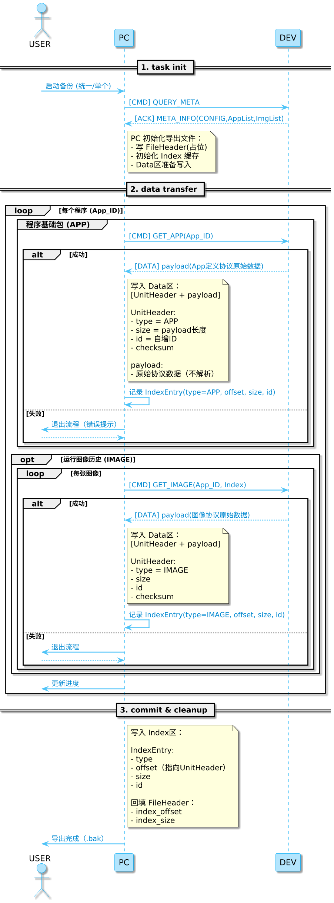
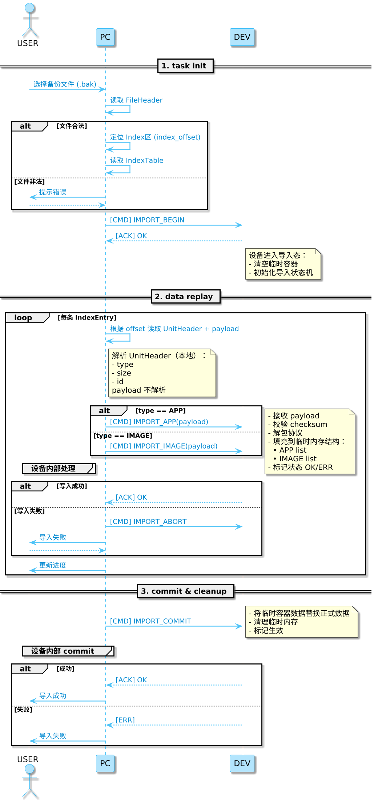
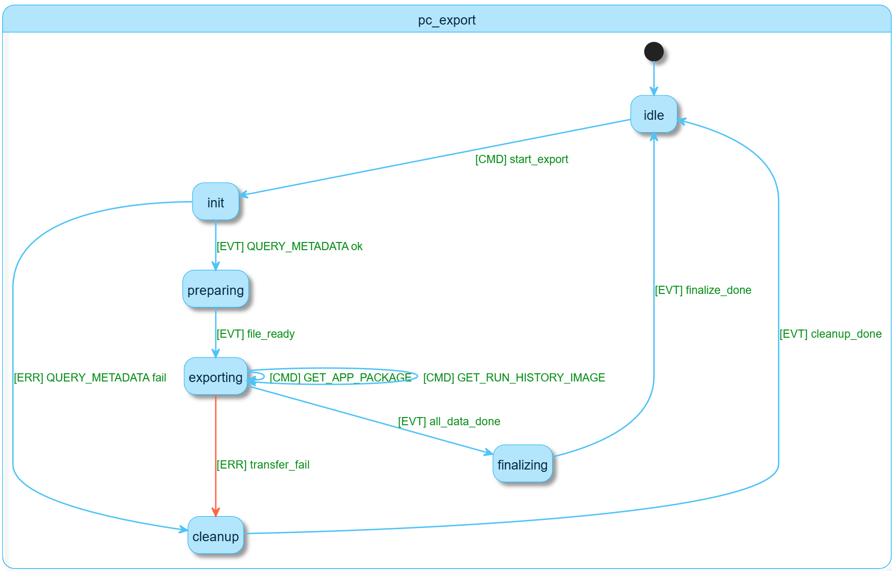
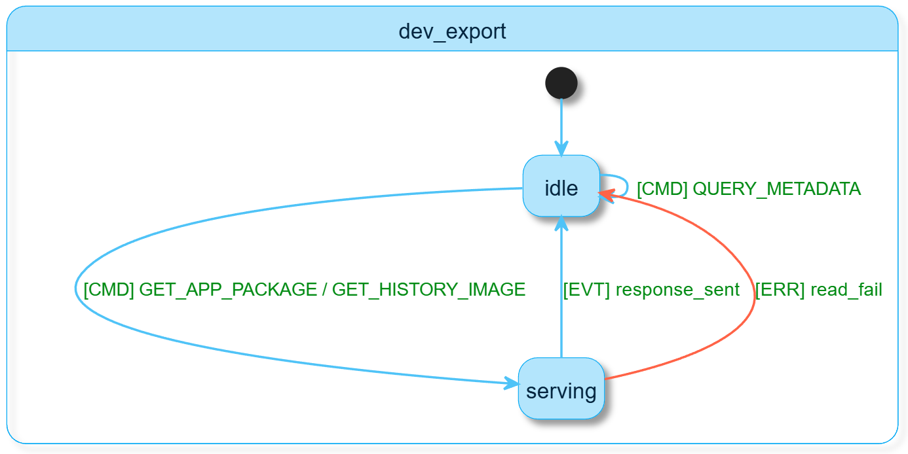
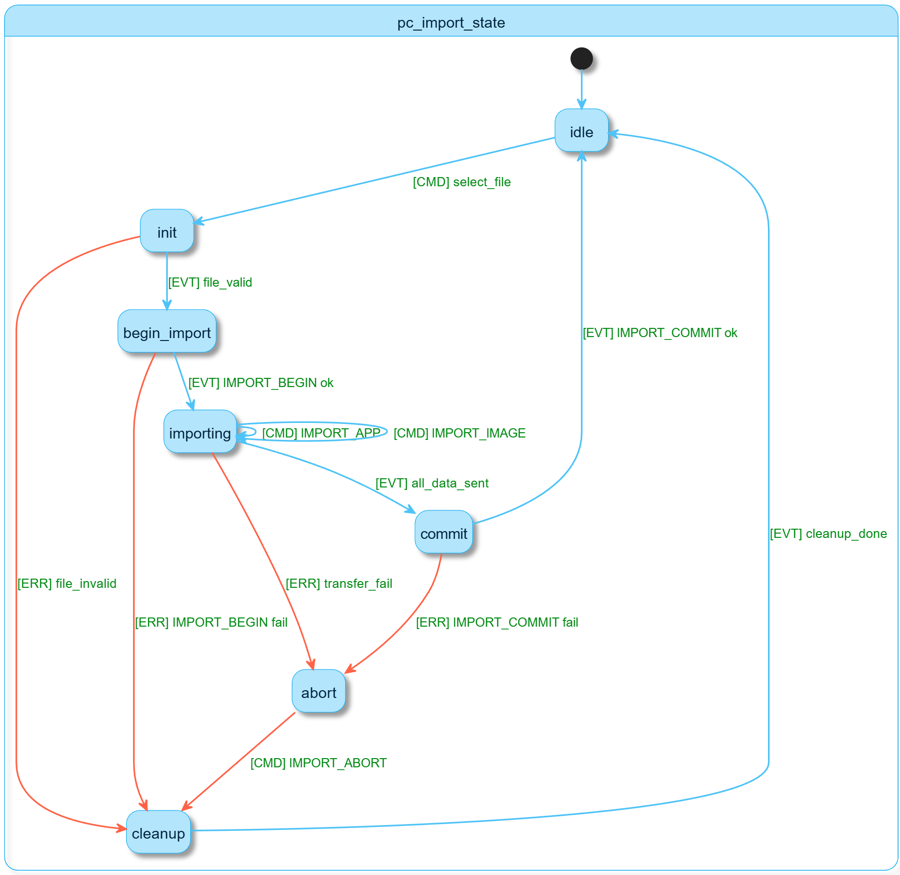
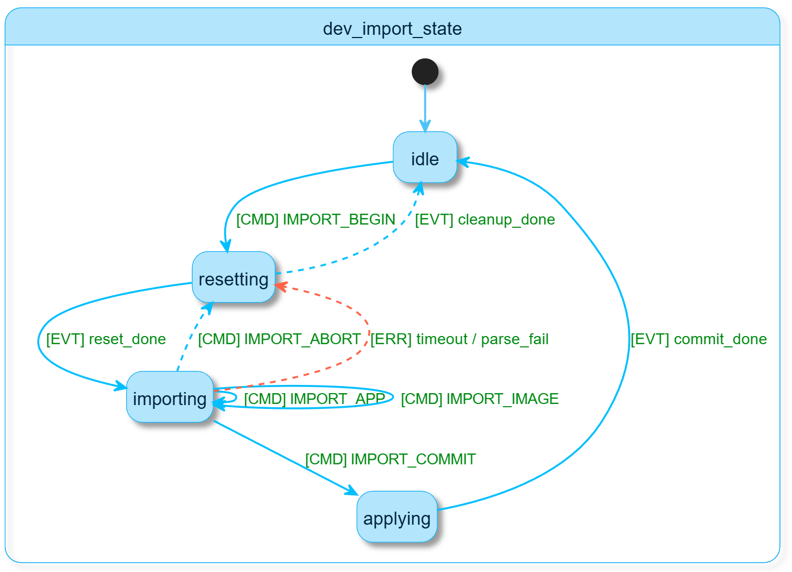
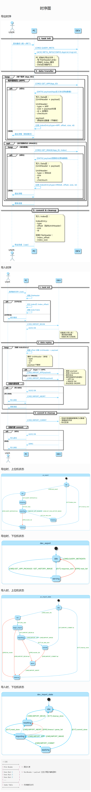

## 时序图

### 导出时序
  

### 导入时序
  

### 导出时，上位机状态
  

### 导出时，下位机状态
  

### 导入时，上位机状态
  

### 导入时，下位机状态


```bash
# 简概
+-------------------+
| File Header        |  <- 固定长度
|-------------------|
| Data Unit 1        |  <- UnitHeader + payload (app/主控图/缩略图/运行图像历史等)
| Data Unit 2        |  
| Data Unit 3        |  
| ...                |
|-------------------|
| Index Table        |  <- 支持随机访问
+-------------------+
```




```plantuml
== 1. 任务初始化 ==
    u ->> p: 发起备份 (全量/单个)
    p ->> d: [CMD] EXPORT_START (Scope)
    
    note right of d
    下位机内部预处理：
    1. 序列化 APP JSON (含图像ID占位)
    2. 收集 主控/追加/缩略图 原始数据
    3. 序列化 RunHistory JSON + 关联图像
    4. 按照自定义二进制协议在内存/Flash打包
    5. 计算总长度 TotalSize
    end note

    d -->> p: [ACK] READY (TotalSize, FileChecksum)
    p ->> p: 创建本地 .bak 文件 (预分配空间)

    == 2. 数据拉取 (流式传输) ==
    loop 按照 Offset 和 ChunkSize 分片拉取
        p ->> d: [CMD] EXPORT_READ_DATA (Offset, Length)
        d -->> p: [DATA] Binary_Chunk (Raw)
        p ->> p: 顺序写入本地文件
        p ->> u: 更新进度 (Current/Total)
    end

    == 3. 完成与校验 ==
    p ->> p: 完成文件写入
    p ->> p: 本地 MD5/CRC 校验
    p ->> u: 导出成功 (.bak)
```


```plantuml
== 1. 任务初始化 ==
u ->> p: 选择 .bak 文件
p ->> p: 获取文件信息 (Size, Checksum)
p ->> d: [CMD] IMPORT_START (TotalSize, FileChecksum)

d -->> p: [ACK] OK (Ready to receive)

note right of d
下位机进入导入态：
- 分配临时缓冲区/打开临时文件
- 初始化解析状态机
end note

== 2. 数据推送 (流式传输) ==
loop 分片推送
    p ->> p: 读取本地文件分片
    p ->> d: [CMD] IMPORT_WRITE_DATA (Offset, Data_Chunk)
    d -->> p: [ACK] OK
    p ->> u: 更新进度
end

== 3. 触发解析与生效 ==
p ->> d: [CMD] IMPORT_COMMIT (通知下位机开始解包)

activate d
note right of d
下位机内部处理：
1. 全局校验 (Checksum)
2. 解析 FileHeader & IndexTable
3. 反序列化 Pro_JSON -> 还原程序
4. 关联提取 图像数据 (主控/追加/缩略)
5. 还原 RunHistory 记录
6. 覆盖/合并到正式数据库
end note
d -->> p: [ACK] SUCCESS / [ERR] CODE
deactivate d

alt 成功
    p ->> u: 导入成功
else 失败
    p ->> u: 提示具体错误原因
end
```

导入2
note over u, d: 阶段 1: 文件流式推送 (Data Pushing)

u ->> p: 选择 .bak 文件
p ->> p: 计算本地文件 MD5 & Size
p ->> d: [CMD] IMPORT_START (FileSize, FileMD5)
d -->> p: [ACK] READY (OK to send)

loop 分片上传
    p ->> p: 读取本地文件块
    p ->> d: [CMD] IMPORT_WRITE_CHUNK (Offset, Data_Block)
    d -->> p: [ACK] OK
    p ->> u: 更新 UI 进度条 (%)
end

note over u, d: 阶段 2: 下位机离线解包 (Internal Unpacking)

p ->> d: [CMD] IMPORT_EXECUTE (触发解析)
activate d
note right of d
    下位机内部逻辑：
    1. 验证全文件 MD5
    2. 读取末尾 Index Table 建立内存索引
    3. 遍历 Index 项：
       - 跳转 Offset 读取 UnitHeader
       - 解析 APP_JSON -> 更新程序库
       - 解析 IMAGE -> 写入存储并关联 ID
       - 解析 RUN_HIST -> 还原历史记录
    4. 清理临时存储空间
end note

alt 解析成功
    d -->> p: [ACK] SUCCESS (Report: Apps=N, Imgs=M)
    p ->> u: 提示“导入成功，数据已刷新”
else 解析失败 (CRC错误/空间不足)
    d -->> p: [ERR] ERROR_CODE
    p ->> u: 提示“导入失败：[具体原因]”
end
deactivate d

导出2
note over u, d: 阶段 1: 下位机后台打包 (Internal Packing)

u ->> p: 点击“导出备份”
p ->> d: [CMD] EXPORT_PREPARE (Scope: Full/Single)
activate d
note right of d
    下位机内部处理：
    1. 扫描数据库 (Apps, Images, History)
    2. 预估总大小并分配临时存储空间
    3. 遍历数据写入 Data Units
    4. 统计 Offset 写入 Index Table
    5. 计算全文件 MD5 并回填 File Header
end note
d -->> p: [ACK] PREPARE_DONE (FileSize, FileMD5)
deactivate d

note over u, d: 阶段 2: 文件流式拉取 (Data Pulling)

p ->> p: 创建本地 .bak 文件 (预分配空间)

loop 分片下载 (直至 TotalSize)
    p ->> d: [CMD] EXPORT_READ_CHUNK (Offset, ChunkSize)
    d -->> p: [DATA] Binary_Block (Raw Data)
    p ->> p: 顺序写入本地文件
    p ->> u: 更新 UI 进度条 (%)
end

note over u, d: 阶段 3: 校验与完成 (Verification)

p ->> p: 本地 MD5 校验 (与下位机给出的 MD5 对比)
alt 校验通过
    p ->> u: 提示“导出成功”
else 校验失败
    p ->> u: 提示“数据校验异常，请重试”
end


### 导入3

note over u, d: 阶段 1: 全量二进制传输

u ->> p: 选择备份文件
p ->> d: [CMD] IMPORT_START (FileSize, MD5)
d -->> p: [ACK] OK (已分配临时存储区)

loop 分片推送
    p ->> d: [CMD] WRITE_TEMP_FILE (Offset, Data)
    d -->> p: [ACK] OK
end

note over u, d: 阶段 2: 下位机利用索引分步解析

p ->> d: [CMD] IMPORT_EXECUTE
activate d
note right of d
    1. 校验 MD5
    2. **读取末尾 Index Table**:
       定位文件末尾，读取索引到内存
    3. **按索引随机访问 (Random Access)**:
       - 根据 IndexEntry1 -> Seek 到 Offset1 -> 解析 APP
       - 根据 IndexEntry2 -> Seek 到 Offset2 -> 存储图像
       (无需扫全表，内存只占一个 Unit 的大小)
    4. 清理临时区，使数据生效
end note

d -->> p: [ACK] SUCCESS
deactivate d

### 导出3

note over d: 阶段 1: 下位机本地分步 IO 构建文件

u ->> p: 发起导出
p ->> d: [CMD] EXPORT_PREPARE
activate d
note right of d
    1. 预留 FileHeader 空间 (Seek 0 + Offset)
    2. 遍历数据：
       - 序列化一个 APP_JSON -> 写入 Data 区
       - 读取关联图像 -> 写入 Data 区
       - **实时记录** 每个 Unit 的 Offset/Size 到临时索引列表
    3. 数据写完后，在末尾写入 Index Table
    4. 回到文件头 (Seek 0)，回填最终 FileHeader
    5. 计算全文件 MD5
end note
d -->> p: [ACK] READY (TotalSize, MD5)
deactivate d

note over u, d: 阶段 2: 完整 bin 文件搬运

loop 分片拉取 (Read by Offset)
    p ->> d: [CMD] READ_FILE_DATA (Offset, Length)
    d -->> p: [DATA] Binary_Block
    p ->> p: 直接追加到本地 .bak 文件
    p ->> u: 更新进度 (%)
end

p ->> p: 校验全文件 MD5
p ->> u: 导出成功
