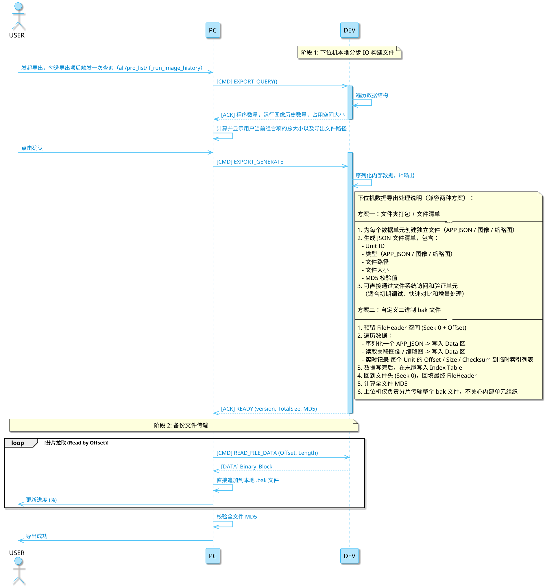
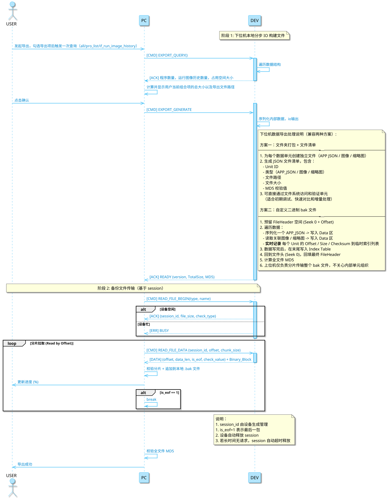
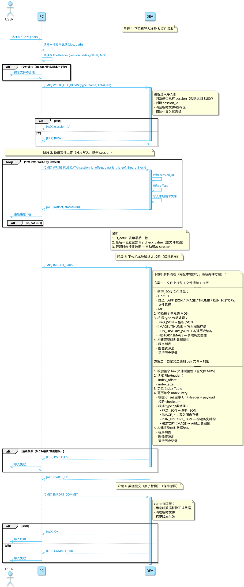
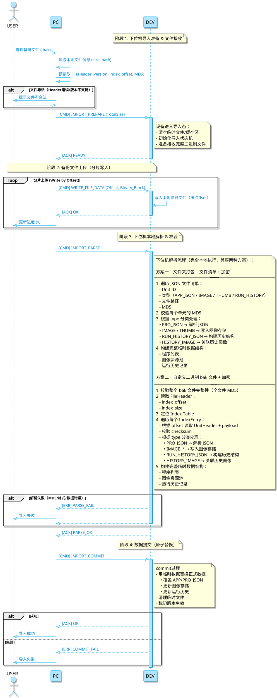
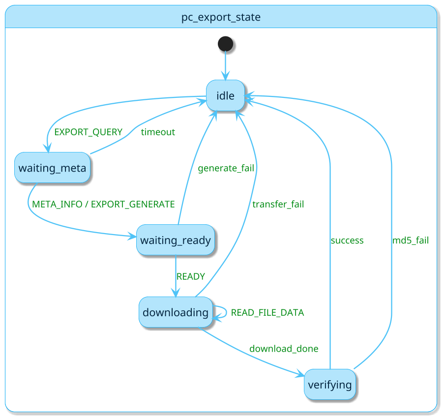
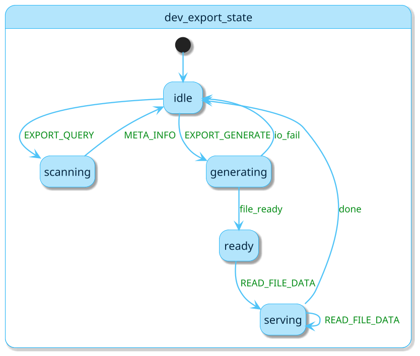
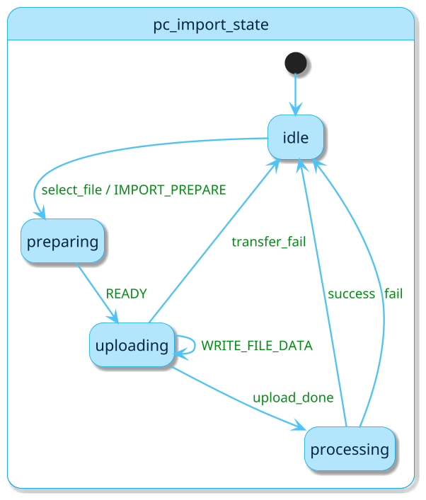
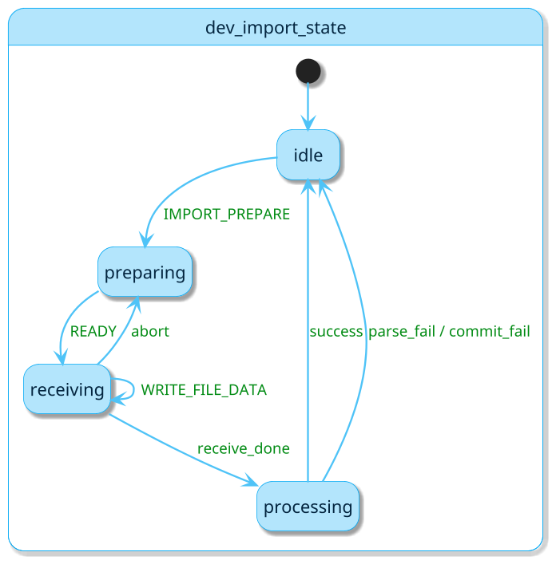
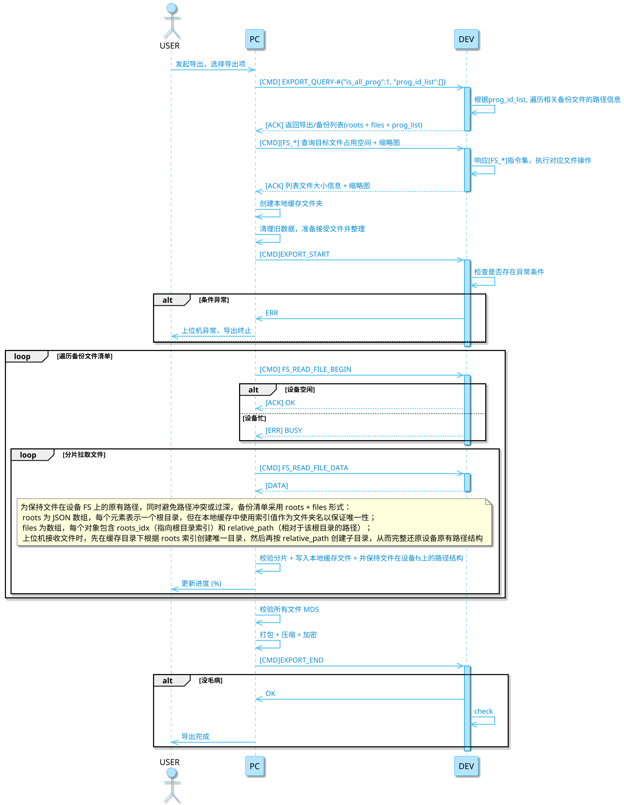
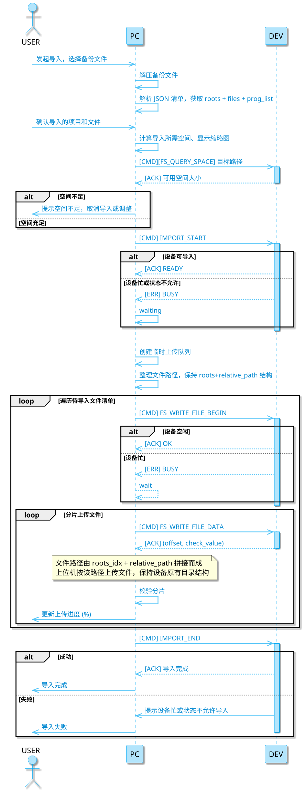

## 备份数据定义和分类

数据单元

config json:
    system-device_info
    system-time_sync
    system-protocol
    system-ftp
    system-global_behavior
    npm
    npm-progs

config img bin:
    master_img
    thumb_img
    learn_img

alg model bin:
    model

### 掉点保存的json

```json
{
    "system": {
        "device_info": {
            "alias": "NV5"
        },
        "network": {
            "ip": "192.168.10.130",
            "mask": "255.255.255.0",
            "gw": "192.168.10.1"
        },
        "time_sync": {
            "ntp_server": ""
        },
        "protocol": {
            "active": {
                "type": "NONE", 
                "enable": 0
            },
            "fieldbus_param": {
                "handshake": 0,
                "byte_swap": 0,
                "tool_count": 7
            },
            "ethernet_ip": {
                "input_size": 100,
                "output_size": 100,
                "handshake": 1
            },
            "profinet": {
                "name": "",
                "detailed_mode": "",
                "tool_count": 7,
                "control_modules": 1,
                "status_modules": 1
            }
        },
        "ftp": {
            "host": "1.2.3.4",
            "port": 21,
            "user": "admin",
            "pass": "123",
            "save_config": {
                "type": "NG",
                "enable": 1
            }
        },
        "global_behavior": {
            "prog_switch_src": 0,
            "led_mode": "running"
        }
    },

    "npm": {
        "cur_prog": 0,
        "progs": [
            {
                "prog_id": 0, 
                "mode": "standard", 
                "name": "用户随便填的名字，允许重复", 
                "is_inited": true, 
                "vi_param": {
                "anything": "anything" 
                }, 
                "runhistory_cond": {
                  "anything"
                },
                "trig_param": {
                    "mode": 0, 
                    "param": {
                        "enable": 0, 
                        "delay": 50
                    }
                }, 
                "master_img": [
                    {
                        "id": 0,
                        "store_id": "P000_C_0",
                        "name": "用户随便填的名字，允许重复"
                    }, 
                    {
                        "id": 1,
                        "store_id": "P000_C_1",
                        "name": "用户随便填的名字，允许重复"
                    } 
                ],
                "node_list": {
                    "preproc": [
                        {
                            "node_id": "PRE0", 
                            "node_type": "COLOR_FILTER", 
                            "param" : {
                                "anything": "anything" 
                            }
                        }
                    ],
                    "atool": [
                        {
                            "node_id": "T0", 
                            "node_type": "LEARN_TOOL", 
                            "param" : {
                                "anything": "anything" 
                            }
                        },
                        {
                            "node_id": "T1",
                            "node_type": "POSITION_CORRECTION", 
                            "param" : {
                                "anything": "anything" 
                            }
                        }
                    ],
                    "postproc": [
                        {
                            "anything": "anything" 
                        }
                    ],
                    "output_logic": [
                        {
                        "node_id": "OL0", 
                        "node_type": "OUTPUT_LOGIC", 
                            "param" : {
                                "anything": "anything" 
                            }
                        }
                    ]
                } 
            }
        ] 
    }
}
```

### 当前基础报文格式

1. 报文格式
    所有端口接收到的应用层报文遵循以下格式：
    请求报文：
    Command-#Payload[CR]

    Simple Payload (ASCII) ：用于高频控制。参数间用  ,  分隔。
    Complex Payload (JSON) ：用于参数配置。Payload 为完整的 JSON 字符串。

    响应报文：
    成功： Command-#OK[CR]  或  Command-#ResultData[CR]
    失败： ER-#Command-#ErrorCode[CR]

    符号定义：
    结束符： CR  (0x0D)
    分隔符： -#

2. 传送图像、升级包等二进制数据格式
    上位机发送： Import_Img-#{"size":1024,"height":{int},"width":{int}, "color_space":{int}}-#binary
    下位机响应：
    注册主控： Import_Img-#{"status":"OK","target_cmd": "Reg_MasterImg"}
    添加样本： Import_Img-#{"status":"OK","target_cmd": "ATool_AddSample", "sample_id": "S_001" }
    设置vi源： Import_Img-#{"status":"OK","target_cmd": "Set_ViSrc"}

3. 传送图像、升级包等二进制数据格式
    上位机发送： Import_Img-#{"size":1024,"height":{int},"width":{int}, "color_space":{int}}-#binary
    下位机响应：
    注册主控： Import_Img-#{"status":"OK","target_cmd": "Reg_MasterImg"}
    添加样本： Import_Img-#{"status":"OK","target_cmd": "ATool_AddSample", "sample_id": "S_001" }
    设置vi源： Import_Img-#{"status":"OK","target_cmd": "Set_ViSrc"}

### 指令和接口

tip: `<xxx>`表示格式中的占位部分

查询程序数量和空间占用情况

1. pc->dev: `EXPORT_QUERY-#<json>CR`

    ```JSON
    {
        "is_prog_all":{int},
        "is_attach_run_history":{int},
        "prog_idx":[1,3,4]
    }
    ```

2. dev->pc: `EXPORT_QUERY-#<json>CR`

    ```JSON
    {
        "prog_count":{int},
        "prog_list": [
            {"id":{int}, "name":{string}, "size_mb":{int}, "has_thumb":1, "master_count":2,"master_list":[{"id":0},{"id":1}], "run_history_count": 10, "run_history_size_mb": 20},
            {"id":{int}, "name":{string}, "size_mb":{int}, "has_thumb":0, "master_count":2, "master_list":[{"id":0}], 
                "run_history_count": 30, "run_history_size_mb": 60
            }
        ]
    }
    ```

上位机下发备份文件生成指令，下位机生成完成or异常返回

1. pc->dev: `EXPORT_GENERATE-#<json>CR`

    ```JSON
    {
        "is_prog_all":{int},
        "is_attach_run_history":{int},
        "prog_idx":[1,3,4]
    }
    ```

2. dev->pc: `EXPORT_GENERATE-#<json>CR`

    ```JSON
    {
        "is_success":{int},
        "export_version": {float},
        "bin_size_byte": {int},
        "bin_md5": {int}
    }
    ```

可补充pc主动获取info的指令，用于断点续传，校验
TODO

导出传输文件
发起读取（创建会话）

1. pc->dev: `READ_FILE_BEGIN-#<json>CR`

    ```JSON
    {
        "type": {string},
        "name": {string}
    }
    ```

2. dev->pc: `READ_FILE_BEGIN-#<json>CR`

    ```JSON
    {
        "session_id": {int},
        "file_size": {int},
        "check_type": {int}   // 1=checksum, 2=crc32
    }
    ```

分片读取（循环）

1. pc->dev: `READ_FILE_DATA-#<json>CR`

    ```JSON
    {
        "session_id": {int},
        "offset": {int},
        "chunk_size": {int}
    }
    ```

2. dev->pc: `READ_FILE_DATA-#<json>-#<binary>CR`

    ```JSON
    {
        "session_id": {int},
        "offset": {int},
        "data_len": {int},
        "is_eof": {int},
        "check_type": {int},
        "check_value": {int}
    }
    ```

导入传输文件

发起写入（创建会话 + 加锁）

1. pc->dev: `WRITE_FILE_BEGIN-#<json>CR`

    ```JSON
    {
        "type": {string},
        "name": {string},
        "file_size": {int},
        "check_type": {int}
    }
    ```

2. dev->pc: `WRITE_FILE_BEGIN-#<json>CR`

    ```JSON
    {
        "session_id": {int}
    }
    ```

分片写入（循环，最后一包结束）

1. pc->dev: `WRITE_FILE_DATA-#<json>-#binaryCR`

    ```JSON
    {
        "session_id": {int},
        "offset": {int},
        "data_len": {int},
        "is_eof": {int},
        "check_type": {int},
        "check_value": {int},
        "file_check_value": {int}   // 仅 is_eof=1 时有效
    }
    ```

2. dev->pc: `WRITE_FILE_DATA-#<json>CR`

    ```JSON
    {
        "session_id": {int},
        "offset": {int},
        "data_len": {int},
        "status": 0
    }
    ```

导入解析（本地解析 + 校验）

1. pc->dev: `MPORT_PARSE-#<json>CR`

    ```JSON
    {
        "session_id": {int}
    }
    ```

2. dev->pc: `WRITE_FILE_DATA-#<json>CR`

    ```JSON
    {
        "session_id": {int},
        "status": 0
    }
    ```

数据提交（原子替换）

1. pc->dev: `IMPORT_COMMIT-#<json>CR`

    ```JSON
    {
        "session_id": {int}
    }
    ```

2. dev->pc: `IMPORT_COMMIT-#<json>CR`

    ```JSON
    {
        "session_id": {int},
        "status": 0
    }
    ```

导入取消

1. pc->dev: `MPORT_CANCEL-#<json>CR`

    ```JSON
    {
        "session_id": {int}
    }
    ```

2. dev->pc: `IMPORT_CANCEL-#OKCR`


template

1. pc->dev: `WRITE_FILE_DATA-#<json>-#binaryCR`

    ```JSON
    
    ```

2. dev->pc: `WRITE_FILE_DATA-#<json>CR`

    ```JSON
    
    ```

断点续传
TODO

协议约束
协议约束（必须实现）
1. 单会话限制
同一时间仅允许一个 WRITE_FILE_BEGIN 成功，否则返回 BUSY
2. session 校验
所有 DATA 请求必须校验 session_id
不匹配返回：ER-#XXX-#SESSION_INVALID
3. offset 校验
offset 必须严格匹配当前进度，否则返回错误
4. 超时释放
超过 N 秒无数据 → 自动释放 session
5. 校验规则
check_value = 当前分片校验
file_check_value = 整文件校验（仅最后一包）


协议约束（导入侧）
1. session 必须一致
所有 IMPORT_* 命令必须携带 session_id
否则返回 SESSION_INVALID
2. 状态顺序约束
WRITE_FILE_BEGIN → WRITE_FILE_DATA → IMPORT_PARSE → IMPORT_COMMIT
3. 失败处理
PARSE_FAIL → session 释放
COMMIT_FAIL → session 释放
4. 超时处理
长时间未操作 → 自动释放 session


| 序号 | 指令           | 参数                         | 响应              1   | 说明                         |
|------|----------------|------------------------------|----------------------|------------------------------|
| 1    | EXPORT_QUERY   | 无                           | EXPORT_QUERY-#{"prog_count":{int}, "prog_list":{"id":{int}, "name":{string}, "size_mb":{int}, "has_thumb":1
}, "run_history": }    | 查询设备可导出数据概况       |
| 2    | EXPORT_GENERATE| 导出类型(all/pro_list/...)   | READY + 文件信息     | 下位机生成 bak 文件          |
| 3    | READ_FILE_DATA | Offset, Length               | Binary 数据块        | 按偏移读取 bak 文件          |
| 4    | IMPORT_BEGIN   | 无                           | ACK                  | 进入导入模式                 |
| 5    | IMPORT_DATA    | Binary 数据块                | ACK                  | 写入导入数据                 |
| 6    | IMPORT_COMMIT  | 无                           | ACK/ERR              | 提交并应用导入数据           |
| 7    | IMPORT_ABORT   | 无                           | ACK                  | 中止导入流程                 |

## 时序导出1



## 时序导出2



## 时序导入2



## 时序导入1



### state template

```plantuml
@startuml
hide empty description
skinparam state {
    BackgroundColor #B3E5FC
    BorderColor #03A9F4
    FontColor #03253f
    FontSize 14
}
skinparam shadowing true
skinparam ArrowColor #4FC3F7
skinparam ArrowFontColor #028b14
skinparam ArrowFontSize 12
skinparam ArrowThickness 1.5
skinparam backgroundColor #FFFFFF
skinparam dpi 150
top to bottom direction
' start

'end
@enduml
```

### 导出-上位机



### 导出-下位机1



### 导入-上位机1



### 导入-下位机1




导出由pc控制节奏，可以
导入由 PC 主动驱动，因为“数据源在 PC，设备只是被动接收方”
自定义 bin 的核心价值是：统一结构 + 可校验 + 可扩展 + 高效传输  单文件，有索引可按模块解析
为什么要有 session？设备可能同时连多个客户端，但同一时间只能有一个传输。
session 就是给这次传输一个唯一标识，避免数据混乱


## 图片

  

  

  

## 时序导出-方案2

```plantuml
@startuml
skinparam sequence {
    ActorBorderColor #03A9F4
    ActorBackgroundColor #B3E5FC
    LifeLineBorderColor #03A9F4
    LifeLineBackgroundColor #B3E5FC
    ParticipantBorderColor #03A9F4
    ParticipantBackgroundColor #B3E5FC
    ArrowColor #4FC3F7
    ArrowFontColor #0288D1
    ArrowFontSize 12
    ArrowThickness 1.5
    FontColor #01579B
    FontSize 14
}
skinparam shadowing true
skinparam backgroundColor #FFFFFF
skinparam dpi 150

actor USER as u
participant PC as p
participant DEV as d

' ================================
' 阶段 1: 查询数据规模（不变）
' ================================
u ->> p: 发起导出，选择导出项
p ->> d: [CMD] EXPORT_QUERY()
activate d

d ->> d: 遍历数据结构
d -->> p: [ACK] 程序数量 / 运行历史 / 空间估算

deactivate d

p ->> p: 计算总大小 & 显示路径
u ->> p: 点击确认

' ================================
' 阶段 2: 数据单元流式导出（核心修改）
' ================================

note over u, d: 阶段 2: 数据单元流式导出（无本地文件）

' ✅ 建立导出会话
p ->> d: [CMD] EXPORT_BEGIN(type, filter)
activate d

alt 设备空闲
    d ->> d: 初始化导出上下文（游标/迭代器）
    d -->> p: [ACK] (session_id, total_unit_count)
else 设备忙
    d -->> p: [ERR] BUSY
end

deactivate d


' ================================
' 按“数据单元”逐个/分片获取
' ================================

loop 拉取数据单元（Unit）

    p ->> d: [CMD] EXPORT_READ_UNIT(session_id)
    activate d

    d ->> d: 
        ' - 按当前游标取下一个数据单元：
          • PRO_JSON
          • PRO_MAIN_IMG
          • PRO_THUMB
          • RUN_HISTORY_JSON
          • RUN_IMAGE / THUMB

        - 序列化为 payload
        - 计算 CRC32 / MD5

    d -->> p: 
        [DATA]
        (unit_id, type, size, is_last, check_value)
        + Binary_Payload

    deactivate d

    note right of p
        上位机处理：
        1. 根据 type 分类
        2. 可选：
           - 写入文件夹（调试方案）
           - 写入自定义 bak（正式方案）
        3. 记录 Index / MD5
    end note

    p ->> u: 更新进度

    alt is_last == 1
        break
    end

end


' ================================
' 阶段 3: 收尾
' ================================

' p ->> p:
'     - 若为 bak：
'         • 写 Index Table
'         • 回填 FileHeader
'         • 计算整体 MD5

' p ->> u: 导出完成

@enduml
```

## 方案2的思考

如何保证数据一致性（运行中数据会变）

必须引入“快照（Snapshot）”

如何让用户选择导出内容

必须先给“可视化结构（Manifest）”

如何让用户选择导出内容

必须先给“可视化结构（Manifest）”


1. EXPORT_QUERY        → 获取统计信息
2. EXPORT_SNAPSHOT     → 固定数据状态（关键！）
3. EXPORT_MANIFEST     → 获取结构清单（可选项）
4. USER选择导出项
5. EXPORT_BEGIN        → 下发任务
6. EXPORT_READ_UNIT    → 按Unit拉取
7. EXPORT_END

数据流方向
导出，上位机拉，根据manifest，按自己节奏获取
导入，上位机推，根据manifest，根据下位机反馈推入

## 方案3

现在方案改了，和领导商讨以后，之前有一个信息忽略了，文件分为几类，一个是总的json配置，里面包含了相机的程序逻辑和工具逻辑以及所有的配置项目，路径是确定的，然后是程序关联的主控图像，缩略图像，以及程序下面各种工具的，总结起来就是所有备份迁移需要的东西都是在路径下存在的实体，并且所有文件都是分类好放在一定目录结构下的，那么本质上其实只要暴露对应的文件访问接口，在备份前上位机获取到备份需要的文件列表，然后调用文件接口去操作，就可以直接相当于备份了，导入同样的，把文件还原到原有位置不就行了，这样只需要定义通用的文件传输协议，加上一些权限，安全管理，然后在触发导入导出之后，上位机查询获取到备份列表，自己组合文件操作备份即可

基于文件清单（Manifest）的文件级导入导出备份模型

由于所有需要备份的数据结构都在设备文件系统中存在实体，并且按一定文件夹结构组织，那么只需要按相对路径保持原有的结构进行备份，还原即可

设备 = 一个文件系统
备份 = 文件复制
导入 = 文件还原

因为只要保持文件夹结构来导出恢复文件，就能实现备份
所以我们的指令和接口可以如何设计，即上位机进行文件访问的指令和接口，如何通用化，并且要有权限或者功能限制，我的想法是 在协议中对特定目录或者文件可以设置权限或者是用途type，这是在下位机或者配置文件中可以配置的，比如某个文件夹下的文件，指令对其进行文件操作时，如果没有设定正确的权限值或者用途type，那么会返回对应错误码的，然后就是协议具体的设计，是否有规范呢标准呢，毕竟http都有文件访问的一些功能

设备侧轻量文件服务协议（File Service Protocol）

1. 上位机可浏览文件（list）
2. 可读文件（read）
3. 可写文件（write）
4. 有权限控制（安全）
5. 有业务语义（type）
6. 可选传输前压缩解压以及加密处理

### nfs指令接口定义

查询最大层数设置
查询类型
覆盖or清空or跳过
防止写一半，写入过程有缓存，提交过程

nfs能力查询

1. pc->dev: `FILE_CAP_QUERY-#<json>CR`
2. dev->pc: `FILE_CAP_QUERY-#<json>CR`

   ```json
   {
        "max_chunk_size": 65536,
        "support_compress": ["none", "gzip"],
        "support_encrypt": ["none", "aes128"],
        "root_paths": ["/config", "/prog", "/image"]
    }
   ```

nfs文件列表查询

1. pc->dev: `FILE_LIST-#<json>CR`

   ```json
   {
        "path": "/prog",
        "recursive": 1
    }
   ```

2. dev->pc: `FILE_LIST-#<json>CR`

   ```json
   {
        "file_count": 2,
        "files": [
            {
                "path": "/prog/1/config.json",
                "size": 1024,
                "md5": "xxx",
                "type": "PRO_CONFIG_JSON",
                "perm": 1
            },
            {
                "path": "/prog/1/main.jpg",
                "size": 204800,
                "md5": "xxx",
                "type": "PRO_MAIN_IMAGE",
                "perm": 1
            }
        ]
    }
   ```

另外关于格式，还是太麻烦了，按我目前的格式展出，能否你按我这个格式
[cmd]-{"":"","":xx} 指令描述
这样就都放到一行里就行了，然后关于指令的名称，用FS作为指令前缀，麻烦把所有指令接口罗列一边，按这个格式

能力类
FS_CAP_QUERY-{} 查询设备文件服务能力
FS_CAP_QUERY-{"max_chunk_size":65536,"support_compress":["none","gzip"],"support_encrypt":["none","aes128"],"root_paths":["/config","/prog","/image"]} 返回能力信息

查询类

FS_STAT-{"path":"/a.json"} 查询文件
FS_STAT-{"code":0,"msg":"OK","path":"/a.json","size":100,"md5":"xxx"} 返回成功
FS_STAT-{"code":-2,"msg":"NOT_FOUND","path":"/b.json"} 返回失败

FS_LIST-{"path":"/prog","recursive":1,"max_depth":2,"list_type":"all","max_count":1000,"cursor":0} 查询文件列表
FS_LIST-{"file_count":120,"has_more":1,"next_cursor":100,"files":[{"path":"/prog/1/","is_dir":1},{"path":"/prog/1/config.json","size":1024,"type":"PRO_CONFIG_JSON","is_dir":0}]} 返回文件列表

<!-- FS_STAT-{"path":"/prog/1/config.json"} 查询单个文件信息
FS_STAT-{"size":1024,"md5":"xxx","type":"PRO_CONFIG_JSON","perm":1} 返回文件详细信息 -->
<!-- FS_LIST-{"path":"/prog","recursive":1,"max_depth":2,"list_type":"all","max_count":1000,"cursor":0} 查询文件列表
FS_LIST-{"file_count":120,"has_more":1,"next_cursor":100,"files":[{"path":"/prog/1/","is_dir":1},{"path":"/prog/1/config.json","size":1024,"type":"PRO_CONFIG_JSON","is_dir":0}]} 返回文件列表 -->

FS_BATCH_STAT-{"paths":["/a.json","/b.json","/c.json"]} 批量查询文件
FS_BATCH_STAT-{"code":0,"msg":"OK","results":[
    {"path":"/a.json","code":0,"size":100,"md5":"xxx"},
    {"path":"/b.json","code":-2,"msg":"NOT_FOUND"},
    {"path":"/c.json","code":0,"size":1024,"md5":"yyy"}
]} 返回结果

读取类（大文件）
FS_READ_BEGIN-{"path":"/prog/1/config.json"} 打开读取会话
FS_READ_BEGIN-{"session_id":1,"file_size":10240} 返回读取会话信息

FS_READ_DATA-{"session_id":1,"offset":0,"size":65536} 分片读取文件
FS_READ_DATA-{"offset":0,"data_len":4096,"is_eof":0,"crc32":12345678}#payload(binary) 返回数据分片

FS_READ_END-{"session_id":1} 关闭读取会话
FS_READ_END-{"status":0} 返回关闭结果

写入类 （大文件）
FS_WRITE_BEGIN-{"path":"/prog/1/config.json","total_size":10240} 打开写入会话
FS_WRITE_BEGIN-{"session_id":1} 返回写入会话信息

FS_WRITE_BEGIN-{"path":"/prog/1/config.json","total_size":10240} 打开写入会话
FS_WRITE_BEGIN-{"session_id":1} 返回写入会话信息

FS_WRITE_DATA-{"session_id":1,"offset":0}#payload(binary) 写入数据分片
FS_WRITE_DATA-{"written":4096} 返回写入结果

FS_WRITE_COMMIT-{"session_id":1} 提交写入
FS_WRITE_COMMIT-{"status":0} 返回提交结果

文件操作类
FS_DELETE-{"path":"/prog/1/config.json"} 删除文件
FS_DELETE-{"status":0} 返回删除结果

FS_MKDIR-{"path":"/prog/2/"} 创建目录
FS_MKDIR-{"status":0} 返回创建结果

FS_MKDIR-{"path":"/prog/2/"} 创建目录
FS_MKDIR-{"status":0} 返回创建结果

检验类
FS_CHECKSUM-{"path":"/prog/1/config.json","type":"md5"} 计算文件校验值
FS_CHECKSUM-{"value":"xxxxxxxx"} 返回校验结果

查询
FS_QUERY_SPACE-{"path":"","unit":"MB","include_child":1}
FS_QUERY_SPACE-{"total_size":40,"used_size":50,"free_size":1, "status":0}

FS_QUERY_FREE_SPACE-{"path":"","unit":"MB","include_child":1}
FS_QUERY_FREE_SPACE-{"total_size":40,"used_size":50,"free_size":1, "status":0}
FS_QUERY_DIR_SIZE-{"path":"/target/dir_or_file","include_child":1,"unit":"MB"}
FS_QUERY_DIR_SIZE-{"size":123.5,"file_count":20,"dir_count":5,"status":0,"error_msg":""}


现在基于这个FS的存在，修改一下导入导出的时序图
主要流程就是用户发起导出时，pc查询设备端的备份文件列表，dev会返回一份备份列表，目前比较纠结的东西，设备端的文件列表以及文件按什么结构存储到上位机，比较麻烦的一点，首先我们导出后再导入，肯定是要把文件还原到固定文件夹的，最简单的方案就是 传输的列表就是所有文件的绝对路径，完全拷贝设备中的目录，在上位机这边的备份文件夹从根目录开始创建，完全还原相关文件需要的父文件夹，但是这样查看以及便利提取时就有些麻烦，万一大家的文件层数都比较深，所以是否有办法 根路径+相对路径的方式，假设100个文件，用这个表示，实际上就两个根目录，所有文件都是这个根目录的相对路径，在这个基础创建父目录就行，需要时拼接一下根目录，问题是用什么方式表示合适，可能大家共同的目录比较少

那么接下去就剩修改时序图了还有补充导入导出除了FS以外的指令了,请参考之前的进行修改，先给我导出的时序图

！！！ 除了文件以外，还需要映射到获取到程序列表
现在基于这个FS的存在，修改一下导入导出的时序图
主要流程就是用户发起导出时，pc查询设备端的备份文件列表，dev会返回一份备份列表
然后上位机根据备份列表，创建本地缓存，然后将备份列表中的文件一个一个读取拷贝到本地，校验md5，并且要保持结构，就用前面说的roots单独存这样，然后压缩打包加密，那么导入的过程也一样，发起导入后，解压获取列表，用户进行选择，然后确认导入文件，解析以后调用FS指令导入,最后commit






导入过程产生的异常如何预防？和异常处理？
