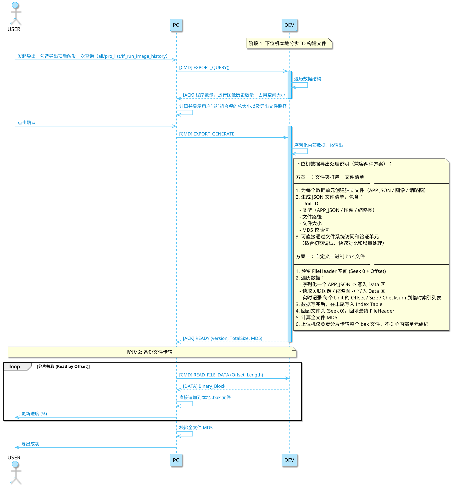
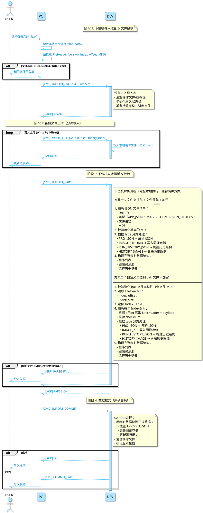
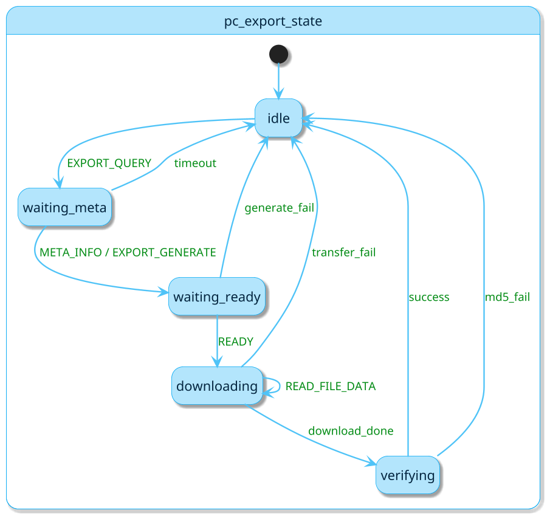
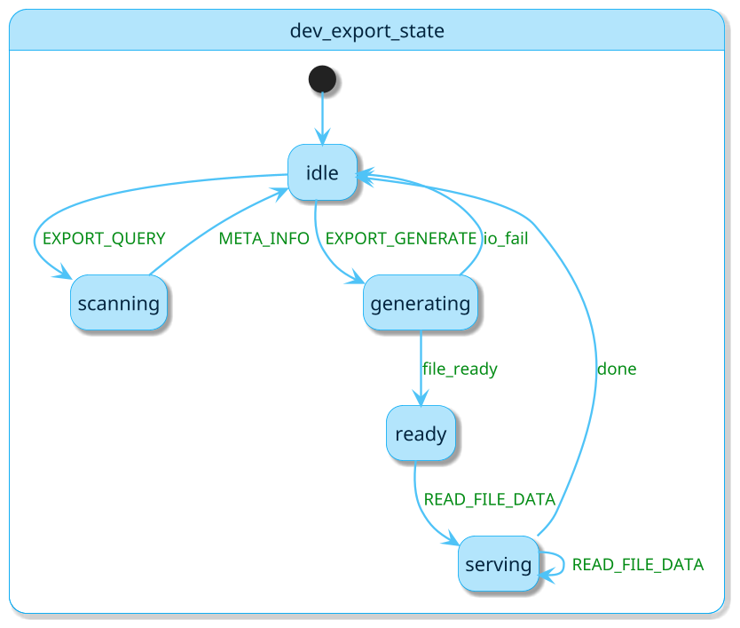
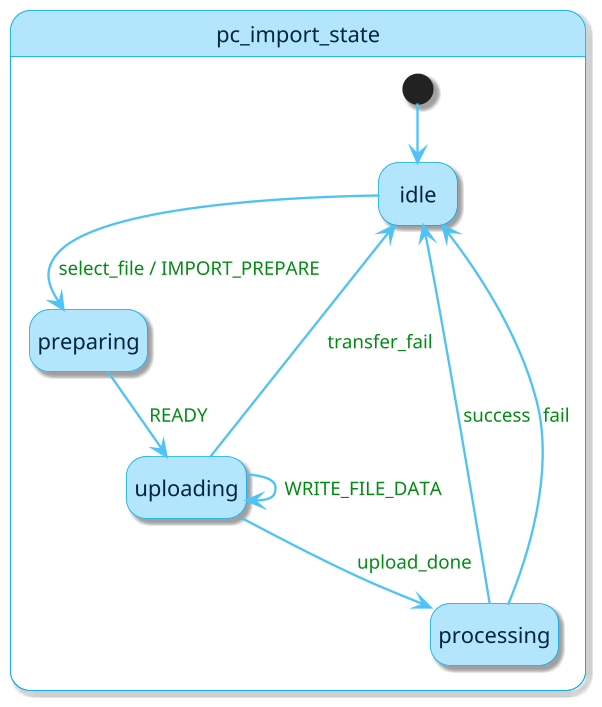
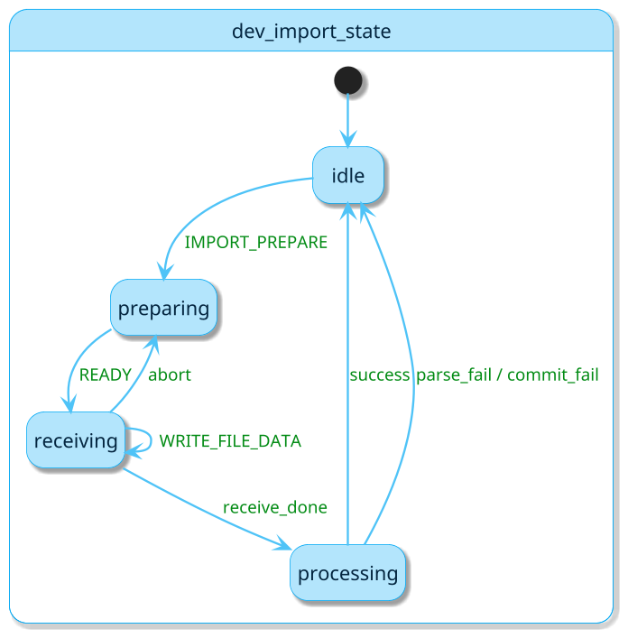

## 指令和数据类型

prog_json
prog_master_image
prog_learn_image
prog_thumb_image
run_image_history_json
run_master_image
run_thumb_image

### 指令

0. 查询程序数量和空间占用情况
1. pc->dev
2. cmd: EXPORT_QUERY-#TODO

    ```JSON
    {
        "is_prog_all":{int},
        "is_attach_run_history":{int},
        "prog_idx":[1,3,4]
    }
    ```

3. rly: EXPORT_QUERY-#TODO

    ```JSON
    {
        "prog_count":{int},
        "prog_list": [
            {"id":{int}, "name":{string}, "size_mb":{int}, "has_thumb":1, "master_count":2,"master_list":[{"id":0},{"id":1}], "run_history_count": 10, "run_history_size_mb": 20},
            {"id":{int}, "name":{string}, "size_mb":{int}, "has_thumb":0, "master_count":2, "master_list":[{"id":0}], 
                "run_history_count": 30, "run_history_size_mb": 60
            }
        ]
    }
    ```

0. 上位机下发备份文件生成指令，下位机生成完成or异常返回
1. pc->dev
2. cmd: EXPORT_GENERATE-#TODO

    ```JSON
    {
        "is_prog_all":{int},
        "is_attach_run_history":{int},
        "prog_idx":[1,3,4]
    }
    ```

3. rly: EXPORT_GENERATE-#TODO

    ```JSON
    {
        "is_success":{int},
        "export_version": {float},
        "bin_size_byte": {int},
        "bin_md5": {int}
    }
    ```
可补充pc主动获取info的指令，用于断点续传，校验

0. 

| 序号 | 指令           | 参数                         | 响应              1   | 说明                         |
|------|----------------|------------------------------|----------------------|------------------------------|
| 1    | EXPORT_QUERY   | 无                           | EXPORT_QUERY-#{"prog_count":{int}, "prog_list":{"id":{int}, "name":{string}, "size_mb":{int}, "has_thumb":1
}, "run_history": }    | 查询设备可导出数据概况       |
| 2    | EXPORT_GENERATE| 导出类型(all/pro_list/...)   | READY + 文件信息     | 下位机生成 bak 文件          |
| 3    | READ_FILE_DATA | Offset, Length               | Binary 数据块        | 按偏移读取 bak 文件          |
| 4    | IMPORT_BEGIN   | 无                           | ACK                  | 进入导入模式                 |
| 5    | IMPORT_DATA    | Binary 数据块                | ACK                  | 写入导入数据                 |
| 6    | IMPORT_COMMIT  | 无                           | ACK/ERR              | 提交并应用导入数据           |
| 7    | IMPORT_ABORT   | 无                           | ACK                  | 中止导入流程                 |

## 时序导出1



### 时序导入1



### state template

```plantuml
@startuml
hide empty description
skinparam state {
    BackgroundColor #B3E5FC
    BorderColor #03A9F4
    FontColor #03253f
    FontSize 14
}
skinparam shadowing true
skinparam ArrowColor #4FC3F7
skinparam ArrowFontColor #028b14
skinparam ArrowFontSize 12
skinparam ArrowThickness 1.5
skinparam backgroundColor #FFFFFF
skinparam dpi 150
top to bottom direction
' start

'end
@enduml
```

### 导出-上位机



### 导出-下位机1



### 导入-上位机1



### 导入-下位机1



