## 功能定义

### 术语集合及功能点分析

#### 候选圆

#### 指定圆

#### 结果圆

#### 算法结果的区分：候选圆和结果圆？上下位机的交互实现？

当前上位机与下位机工具之间定义的 触发算法运行的协议：只有trigger_read，且trigger_read 指令下发时不附带参数
但是在直径工具这里，上位机在设定阶段和运行阶段 触发的算法运行和结果格式存在差异

1. 方案1： 通过在setparam中新增参数 exec_mode 用于决定后续trigger_read，下位机执行算法的动作，值为0，则触发算法提取候选圆，值为1，则触发算法运行，返回唯一结果； 

#### 设定阶段，拖动ROI，触发的算法行为? 结果圆 or 提取候选圆+指定圆

1. 方案1：触发算法提取候选圆 + 下位机判断后返回指定圆
2. 方案2：触发算法运行，返回唯一结果

#### 明暗方向中的全部方向和设定方向有什么差别？

iv4实验，在高灵敏度情况下，二者的候选圆存在细微差异，但数量均是最多的

#### 抽取直径-用户切换指定圆之后-拖动roi或者更新灵敏度，明暗方向等参数-那么此时产生的新候选圆+下位机按照什么逻辑确定 当前候选圆中的指定圆 用于返回给上位机渲染？

1. 下位机缓存指定圆，候选圆变更后，默认选择与缓存指定圆直径最接近的圆，返回给上位机
2. 同操作1，差异点： 算法提供接口，从候选圆中匹配与旧指定圆最详尽的圆
3. 不实现匹配逻辑，直接返回候选圆中居中的圆作为默认指定圆，除非用户手动切换，由用户指定

### 各端操作集合定义

#### 用户操作

#### 上位机行为

#### 下位机行为

#### 算法行为

### 上位机-下位机-算法 行为映射表

UI截图: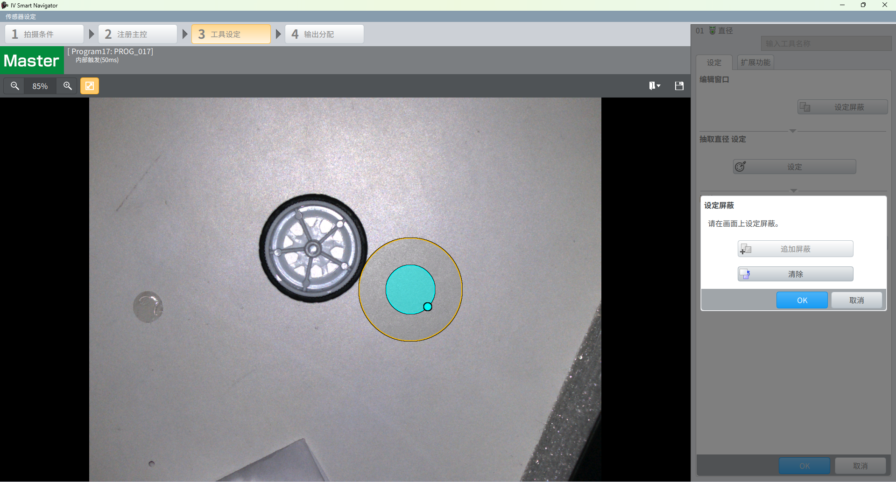

   1. 用户行为: 设定界面-追加屏蔽-点击面板确定按钮
   2. 上位机行为: ATool_SetParam + Trigger_Read(提取候选) + 结果渲染（几何形状固定-圆形，不可移动圆心位置固定与roi相同，半径可调节（0-roi半径），屏蔽效果：候选圆和屏蔽圆边缘相交则不显示该候选圆）
   3. 下位机行为: 重新设置算法ROI+屏蔽区域掩码图，重新设置参数，调用算法提取特征获取候选圆
   4. 算法行为

UI截图: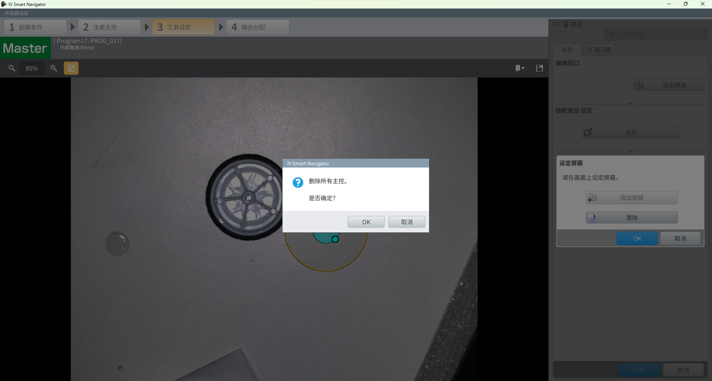

   1. 用户行为: 设定界面-屏蔽面板-清除
   2. 上位机行为: ATool_SetParam + Trigger_Read(提取候选) + 结果渲染（去除所有屏蔽区域）
   3. 下位机行为: 重新设置算法ROI，重新设置参数，调用算法提取特征获取候选圆
   4. 算法行为:

UI截图: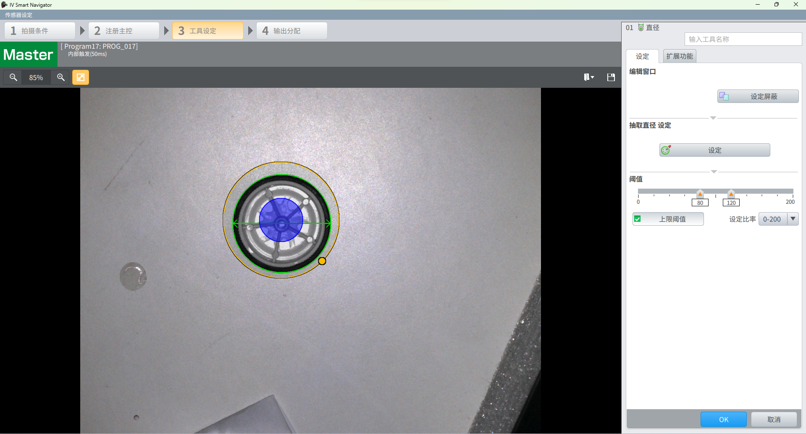

   1. 用户行为: 设定界面-拖动ROI，调节半径 (效果：显示唯一的指定圆)
   2. 上位机行为: ATool_SetParam + Trigger_Read(提取候选) （鼠标左键按下后不释放，拖动roi，这个过程是会实时更新抽取圆的）
   3. 下位机行为: 重新设置算法ROI, 重新设置算法参数，调用算法提取特征获取候选圆，返回候选圆数组结果，以及指定圆的索引（or 调用算法运行接口，返回唯一结果圆）
   4. 算法行为:

UI截图: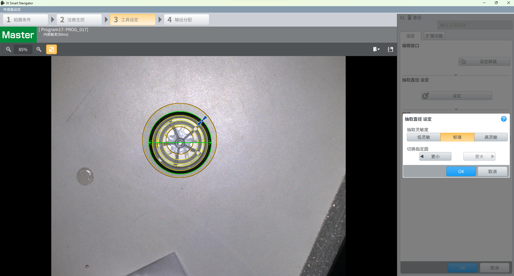

   1. 用户行为: 设定界面-点击抽取直径，选择抽取灵敏度，切换指定圆
   2. 上位机行为: 缓存所有操作参数，点击面板确定后：ATool_SetParam + Trigger_Read(提取候选) + 结果处理（ 默认停留在标准灵敏度，roi区域会渲染所有的候选圆（黄色线条），以及当前选定圆（绿色+提示箭头指向），可以切换更大更小指定圆（若已经到极值，则对应按钮置灰）
   3. 下位机行为: 重新设置算法ROI, 重新设置算法参数，调用算法提取特征获取候选圆，返回候选圆数组结果，以及指定圆的索引（or 调用算法运行接口，返回唯一结果圆）

UI截图: 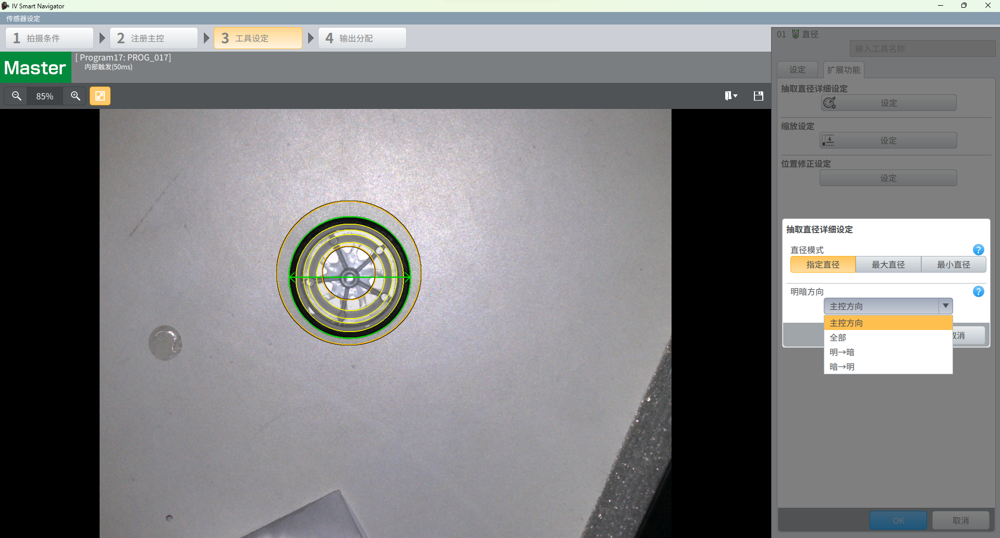

   1. 用户行为: 设定界面-扩展功能-抽取直径详细设定，切换直径模式，切换明暗方向
   2. 上位机行为: 缓存所有操作参数，点击面板确定后： ATool_SetParam + Trigger_Read(提取候选) + 结果处理 （其中最大最小直径只会高亮对应唯一圆，指定直径和点击抽取直径面板相同, 明暗方向候选项）
   3. 下位机行为: 重新设置算法ROI, 重新设置算法参数，调用算法提取特征获取候选圆，返回候选圆数组结果，以及指定圆的索引（or 调用算法运行接口，返回唯一结果圆）

UI截图: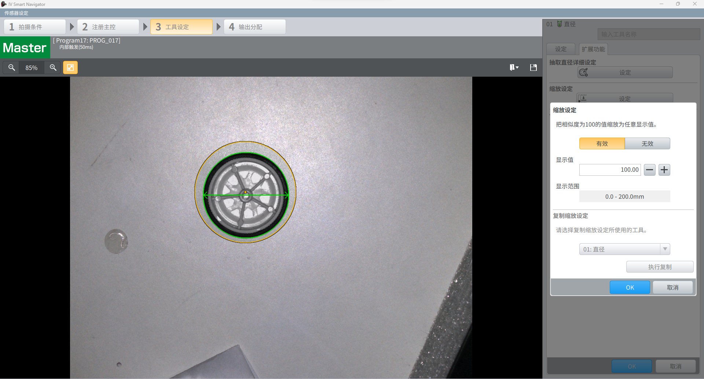

   1. 用户行为: 设定界面-扩展功能-缩放设定 （缩放设定开启有效后，显示范围上限和显示值的数值关系：最高为3倍并只保留最高位，尾数全部抹零）
   2. 上位机行为: ATool_SetParam + 不需要trigger_read
   3. 下位机行为: 更新内部算法参数的缓存

UI截图: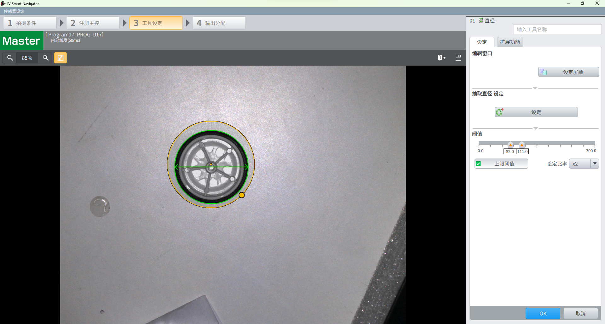

   1. 用户行为: 设定界面-阈值调节，复选开启上限阈值，切换比率（x2和x10）（注上位机控件逻辑：上位机开发注意事项，下限不可拖动到上限右边，，切换比率（x2和x10）为上位机空间的显示逻辑，不用给下位机）
   2. 上位机行为: ATool_SetParam + 不需要trigger_read
   3. 下位机行为: 更新内部算法参数的缓存

UI截图: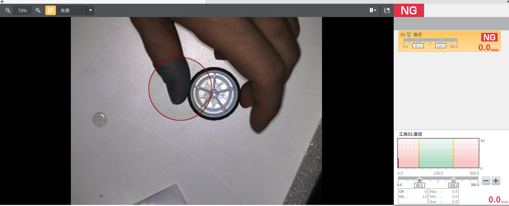

   1. 上位机行为: 运行界面-开始运行，暂停运行，设定阈值
   2. 下位机行为: 开始运行：Set_AutoSend-Run-持续接收Report_Result，渲染结果；暂停运行：Stop-Set_AutoSend；设定阈值：ATool_SetParam
   3. 算法行为: 开启自动定时器，持续触发trigger_read(运行)，更新算法参数缓存

---

## 下位机工具节点 内部实现

## 上位机开发 注意事项

## 工具生命周期与执行流程

---

## 上下位机通信协议与报文定义

### ATool_SetParam

### Trigger_Read

### Set_AutoSend

### Run

### Stop

```json
// =================================================================================
// 协议主题：直径测量工具 (DIAM_TOOL) 基于 exec_mode 的状态驱动执行协议
// 核心逻辑：所有字段固定存在，保证 JSON 结构（Schema）的唯一性和反序列化安全。
//           - exec_mode = 1 (提取): candidates 有数据, diam_result 为空
//           - exec_mode = 0 (运行): candidates 为空 [], diam_result 有数据
// =================================================================================

// ---------------------------------------------------------------------------------
// 【阶段一】设定态：提取候选圆 (Teach - Extract)
// ---------------------------------------------------------------------------------

// 1. 上位机下发参数，指令下位机进入“提取模式”
// [TCP] TX: ATool_SetParam
{
  "id": "T01",
  "config": {
    "exec_mode": 1,            // 🌟 核心：1 表示进入提取模式
    "edge_direction": 0,
    "extract_sensitivity": 1,
    "reference_circle": {      // 提取模式下，暂无基准，字段保留，valid 置为 0
      "valid": 0,
      "x": 0.0,
      "y": 0.0,
      "radius": 0.0
    },
    "pos_adjust_ref": "",
    "regions": [
      {
        "op": "base",
        "shape": "annulus",
        "pts": [
          {"x": 640.0, "y": 480.0, "r1": 100.0, "r2": 200.0}
        ]
      }
    ]
  }
}

// 2. 触发后，下位机回传提取结果
// [TCP] TX: Report_Result
{
  "res_id": 376,
  "tot_res": { /* ... 系统全局状态保持原样 ... */ },
  "atools": [
    {
      "node_id": "T01",
      "node_type": "DIAM_TOOL",
      "status": 0,
      "exec_mode": 1,          // 当前为提取模式
      "cost_time": 45,
      "num_candidates": 3,
      "matched_idx": 0,        
      "candidates": [          // 🌟 提取模式下，候选数组有真实数据
        {"idx": 0, "x": 640.5, "y": 480.2, "radius": 150.5},
        {"idx": 1, "x": 638.0, "y": 479.0, "radius": 145.0},
        {"idx": 2, "x": 645.2, "y": 485.5, "radius": 160.2}
      ],
      "diam_result": {}        // 🌟 保持结构完整：无实测结果，置为空对象 (或 {"x":0,"y":0,"radius":0})
    }
  ]
}

// ---------------------------------------------------------------------------------
// 【阶段二】运行态：固化基准与连续运行 (Run)
// ---------------------------------------------------------------------------------

// 3. 上位机固化基准，指令下位机切回“正常运行模式”
// [TCP] TX: ATool_SetParam
{
  "id": "T01",
  "config": {
    "exec_mode": 0,            // 🌟 核心：0 表示切回正常测算分支
    "edge_direction": 0,
    "extract_sensitivity": 1,
    "reference_circle": {      // 🌟 运行模式下，下发真实有效的基准数据
      "valid": 1,              
      "x": 640.5,
      "y": 480.2,
      "radius": 150.5
    },
    "pos_adjust_ref": "",
    "regions": [ /* ... 用户确认的 ROI 维持原样 ... */ ]
  }
}

// 4. 产线产生触发时，下位机回传唯一结果
// [TCP] TX: Report_Result
{
  "res_id": 377,
  "tot_res": { /* ... 系统全局状态保持原样 ... */ },
  "atools": [
    {
      "node_id": "T01",
      "node_type": "DIAM_TOOL",
      "status": 0,             
      "exec_mode": 0,          // 当前为运行模式
      "cost_time": 15,         
      "num_candidates": 0,     // 数据清零，但字段必须存在
      "matched_idx": -1,       // 数据复位，但字段必须存在
      "candidates": [],        // 🌟 保持结构完整：运行模式下没有候选圆，置为空数组
      "diam_result": {         // 🌟 运行模式下，填充唯一的真实测算结果
        "x": 641.0,            
        "y": 480.0,            
        "radius": 150.2        
      }
    }
  ]
}
```


---

## 算法接口与数据结构定义

```c++
#ifndef __NVS_ALG_DIAM_H__
#define __NVS_ALG_DIAM_H__

#include <stdint.h>
#include "nvs_base_type.h" 

#ifdef __cplusplus
extern "C" {
#endif

// ==========================================================================
// 1. 宏与句柄定义
// ==========================================================================
#define NVS_ALG_DIAM_MAX_CANDIDATE_NUM 16

typedef void* nvs_alg_diam_handle_t;

// ==========================================================================
// 2. 核心数据结构与枚举定义
// ==========================================================================

// 边缘查找方向枚举
typedef enum {
    NVS_ALG_DIAM_DIRECTION_ALL           = 0, // 全部方向
    NVS_ALG_DIAM_DIRECTION_MASTER        = 1, // 主控方向 (沿用基准特征)
    NVS_ALG_DIAM_DIRECTION_DARK_TO_LIGHT = 2, // 暗到明
    NVS_ALG_DIAM_DIRECTION_LIGHT_TO_DARK = 3  // 明到暗
} nvs_alg_diam_edge_direction_e;

// 提取灵敏度档位枚举
typedef enum {
    NVS_ALG_DIAM_EXTRACT_SENS_LOW    = 0, // 低灵敏度 (过滤微小噪点，只提取强对比度边缘)
    NVS_ALG_DIAM_EXTRACT_SENS_MEDIUM = 1, // 中灵敏度 (常规默认配置)
    NVS_ALG_DIAM_EXTRACT_SENS_HIGH   = 2  // 高灵敏度 (可提取微弱对比度边缘)
} nvs_alg_diam_extract_sens_e;

// 设定态：提取参数结构体
typedef struct {
    int32_t edge_direction;      // 边缘明暗方向，传入 nvs_alg_diam_edge_direction_e 枚举值
    int32_t extract_sensitivity; // 提取灵敏度，传入 nvs_alg_diam_extract_sens_e 枚举值
} nvs_alg_diam_extract_param_t;

// 设定时：候选圆数组
typedef struct {
    uint8_t count;
    nvs_circle_t circles[NVS_ALG_DIAM_MAX_CANDIDATE_NUM]; 
} nvs_alg_diam_candidate_circle_array_t;

// 运行时：基准圆结构体
typedef struct {
    nvs_circle_t circle;    // 预期的基准圆物理特征
} nvs_alg_diam_reference_t;

// 运行时：结果圆结构体
typedef struct {
    int32_t status_code;    // 状态码 (0: 成功, <0: 各种异常错误码)
    nvs_circle_t circle;    // 最终实测圆结果
} nvs_alg_diam_result_t;


// ==========================================================================
// 3. 句柄生命周期管理
// ==========================================================================

/**
 * @brief 创建直径测量算法句柄
 * @return 成功返回有效句柄，失败返回 NULL
 */
nvs_alg_diam_handle_t nvs_alg_diam_create(void);

/**
 * @brief 销毁直径测量算法句柄，释放内部资源
 * @param in_handle 算法句柄
 */
void nvs_alg_diam_destroy(nvs_alg_diam_handle_t in_handle);


// ==========================================================================
// 4. 配置态 (TEACH) - 特征提取与重关联
// ==========================================================================

/**
 * @brief 设定检测区域 (Region)
 * @note  在配置态调用：定义直径检测的有效物理范围（Base ROI 以及可能的 Mask 屏蔽区）。
 * @param in_handle       算法句柄
 * @param in_regions      区域数组指针 (包含 Base 以及 Mask/Unmask)
 * @param in_region_count 区域数量
 * @return int32_t        NVS_ALGO_OK: 成功, 其他: 错误码
 */
int32_t nvs_alg_diam_set_region(
    nvs_alg_diam_handle_t in_handle, 
    const nvs_region_t *in_regions, 
    int32_t in_region_count
);

/**
 * @brief 提取候选圆
 * @note  根据设定的参数和区域，对当前图像进行扫描，输出所有符合条件的候选圆集合。
 * 此接口通常仅在设定阶段 (TEACH) 调用，用于提供交互数据源。
 * @param in_handle           算法句柄
 * @param in_img              输入图像数据指针
 * @param in_param            提取控制参数 (明暗方向、灵敏度等级等)
 * @param out_candidate_array [输出] 提取到的候选圆数组结果
 * @return int32_t            NVS_ALGO_OK: 成功, 其他: 错误码
 */
int32_t nvs_alg_diam_extract_candidate(
    nvs_alg_diam_handle_t in_handle,
    const nvs_image_t *in_img,
    const nvs_alg_diam_extract_param_t *in_param,
    nvs_alg_diam_candidate_circle_array_t *out_candidate_array
);

/**
 * @brief 匹配目标圆 (无状态辅助接口)
 * @note  在给定的一组候选圆中，寻找与历史基准圆在空间位置和物理尺寸上最接近的匹配项。
 * 常用于图像刷新或 ROI 拖拽后的目标状态重关联。
 * @param in_old_reference    历史保存的基准圆参数
 * @param in_candidate_array  当前帧新提取出的候选圆数组
 * @param out_matched_idx     [输出] 最佳匹配项在数组中的索引 (-1 表示未找到符合容差的匹配项)
 * @return int32_t            NVS_ALGO_OK: 成功, 其他: 错误码
 */
int32_t nvs_alg_diam_match_circle(
    const nvs_alg_diam_reference_t *in_old_reference,
    const nvs_alg_diam_candidate_circle_array_t *in_candidate_array,
    int32_t *out_matched_idx
);


// ==========================================================================
// 5. 运行态 (RUN) - 连续测算
// ==========================================================================

/**
 * @brief 注入运行时基准圆参数
 * @note  切入运行态前或目标基准发生变更时调用。算法内部需拷贝并缓存此基准信息，
 * 作为后续执行实际测算时的参考基准。
 * @param in_handle    算法句柄
 * @param in_reference 确定的基准圆参数
 * @return int32_t     NVS_ALGO_OK: 成功, 其他: 错误码
 */
int32_t nvs_alg_diam_set_reference(
    nvs_alg_diam_handle_t in_handle,
    const nvs_alg_diam_reference_t *in_reference
);

/**
 * @brief 执行直径测算
 * @note  在连续运行态下调用。算法基于已注入的基准圆 (Reference)，
 * 在当前图像中进行目标测算并输出最终的实测圆。
 * @param in_handle  算法句柄
 * @param in_img     当前高频传入的图像数据指针
 * @param out_result [输出] 实测唯一圆结果及执行状态
 * @return int32_t   NVS_ALGO_OK: 成功, 其他: 错误码
 */
int32_t nvs_alg_diam_run(
    nvs_alg_diam_handle_t in_handle, 
    const nvs_image_t *in_img, 
    nvs_alg_diam_result_t *out_result
);

/* ============================================================================
 * @brief 直径测量工具 (Diameter Measurement) - 三端交互与核心调用时序规范
 *
 * 本说明定义上位机（UI交互）、下位机（业务控制流）与算法层在【配置态】与
 * 【运行态】下的边界职责及标准调用链路。
 *
 * ----------------------------------------------------------------------------
 * [阶段一] 配置态 (CONFIG) - 特征提取与目标重关联
 * ----------------------------------------------------------------------------
 * 业务场景：上位机发起感兴趣区域 (Region) 拖拽、参数变更或主动请求刷新。
 *
 * 执行时序：
 * 1. 区域更新：下位机接收上位机指令，调用 nvs_alg_diam_set_region() 更新底层检测区域。
 * 2. 候选提取：下位机调用 nvs_alg_diam_extract_candidate()，获取当前区域内所有
 * 满足设定参数的候选圆集合。
 * 3. 目标筛选与匹配：
 * - 首次目标锁定：下位机按默认策略在候选集合中筛选出指定的基准圆。
 * - 目标状态重关联：下位机提取历史持久化的基准圆，调用 nvs_alg_diam_match_circle()，
 * 在当前候选集合中获取最佳匹配项的索引。
 * 4. 状态同步与持久化：下位机将候选集合与匹配索引上报上位机进行渲染。用户确认后，
 * 下位机将选定目标作为基准圆 (Reference) 写入持久化存储。
 *
 * ----------------------------------------------------------------------------
 * [阶段二] 运行态 (RUN) - 连续测算
 * ----------------------------------------------------------------------------
 * 业务场景：系统切入运行模式，执行高频连续测算与结果输出。
 *
 * 执行时序：
 * 1. 运行前置准备：切入运行态时，下位机读取持久化的基准圆，调用 
 * nvs_alg_diam_set_reference() 将其设置为运行期基准。
 * 2. 连续测算：下位机随输入图像流循环调用 nvs_alg_diam_run()。算法以设定的
 * 基准圆为参考，输出当前帧的最终实测结果圆。
 * ============================================================================ */v

// ==========================================================================
// 6. 模型与数据管理 (系统预留接口)
// ==========================================================================

/**
 * @brief 获取当前内部配置/状态的数据大小
 * @param in_handle 算法句柄
 * @return uint32_t 模型字节数，0 表示无模型或错误
 */
uint32_t nvs_alg_diam_get_model_size(nvs_alg_diam_handle_t in_handle);

/**
 * @brief 导出模型配置数据到缓冲区
 * @param in_handle   算法句柄
 * @param out_buf     外部申请的缓冲区指针
 * @param in_buf_len  缓冲区大小 (必须 >= get_model_size 返回值)
 * @return int32_t    实际写入的字节数，<0 表示错误
 */
int32_t nvs_alg_diam_export_model(
    nvs_alg_diam_handle_t in_handle, 
    void *out_buf, 
    uint32_t in_buf_len
);

/**
 * @brief 从缓冲区导入模型配置数据
 * @param in_handle   算法句柄
 * @param in_buf      包含模型数据的只读缓冲区指针
 * @param in_data_len 导入数据的实际长度
 * @return int32_t    NVS_ALGO_OK: 成功, 其他: 错误码
 */
int32_t nvs_alg_diam_import_model(
    nvs_alg_diam_handle_t in_handle, 
    const void *in_buf, 
    uint32_t in_data_len
);

#ifdef __cplusplus
}
#endif

#endif // __NVS_ALG_DIAM_H__
```
---

## 下位机内部实现设计

### picture ref

> 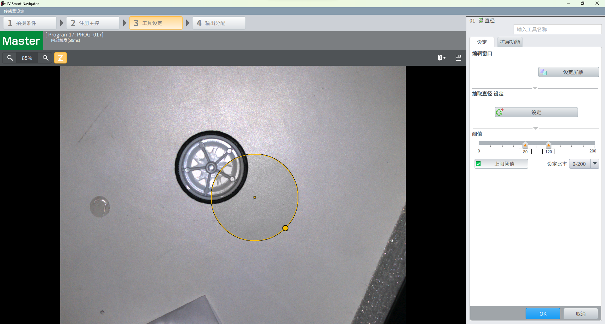 工具设定主界面
> 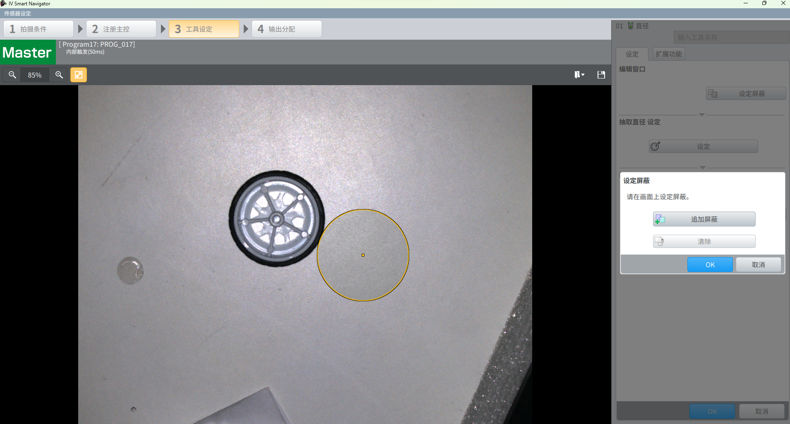 追加屏蔽面板
>  点击追加屏蔽 可以调节屏蔽区域的半径，但不可移动圆心roi以及屏蔽roi的中心点位置，屏蔽后效果，实际检测roi变为环形
>  清除屏蔽，上位机需要弹出确认框
>  roi覆盖被检测物体，会显示默认选定的直径边缘，以及直径箭头
>  点击抽取直径，默认停留在标准灵敏度，roi区域会渲染所有的候选圆（黄色线条），以及当前选定圆（绿色+提示箭头指向），可以切换更大更小指定圆（若已经到极值，则对应按钮置灰）
> 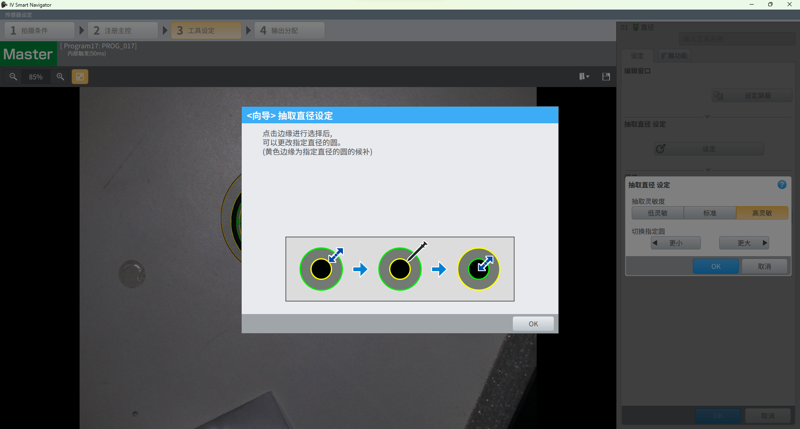 直径抽取提示面板
>  扩展功能抽取直径详细设定，切换直径模式，其中最大最小直径只会高亮对应唯一圆，指定直径和点击抽取直径面板相同
>  明暗方向候选项
> 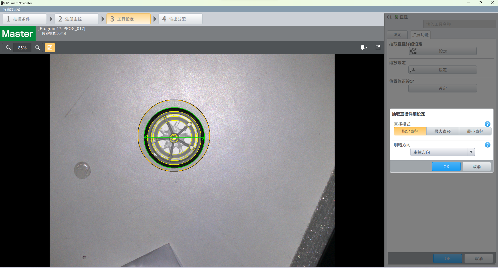 明暗方向-主控方向
> 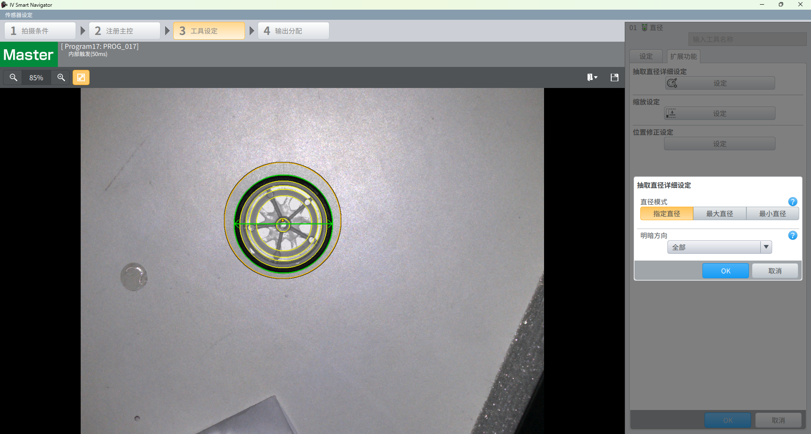 明暗方向-全部
> 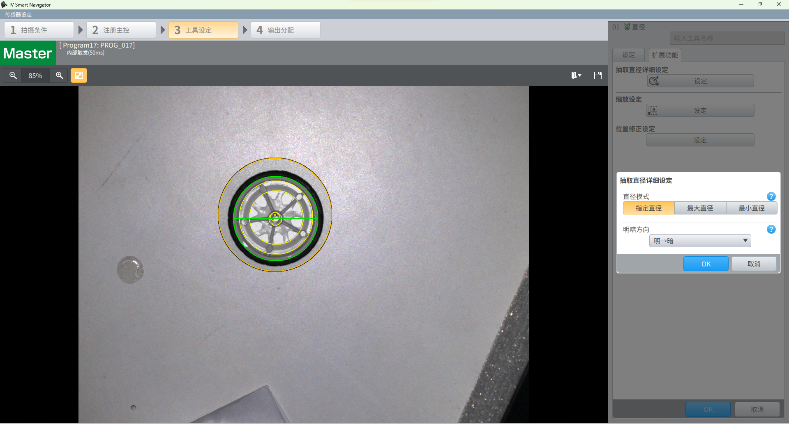 明暗方向-明到暗
> 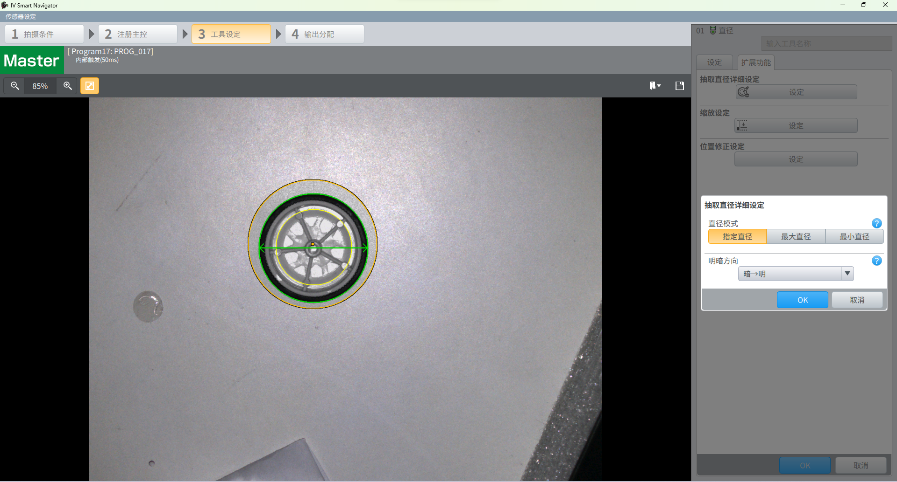 明暗方向-暗到明
> 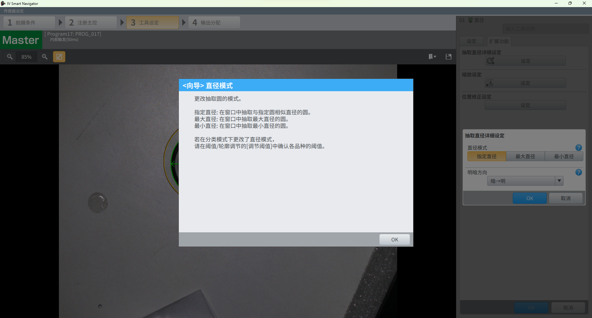 直径模式-提示面板
> 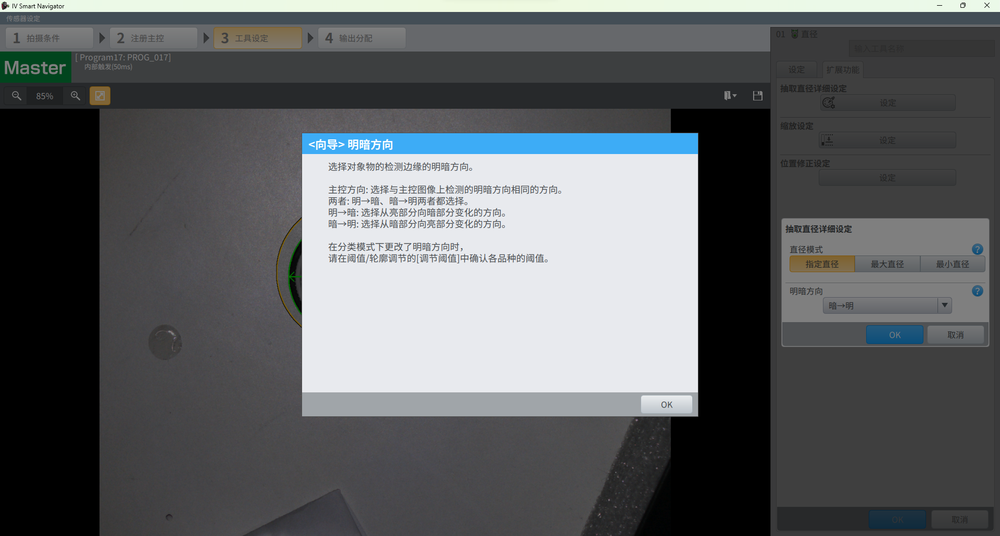 明暗方向-提示面板
>  缩放设定，显示范围上限是显示值的3倍并只保留最高位，尾数全部抹零
>  阈值调节，注：上位机开发注意事项，下限不可拖动到上限右边
> 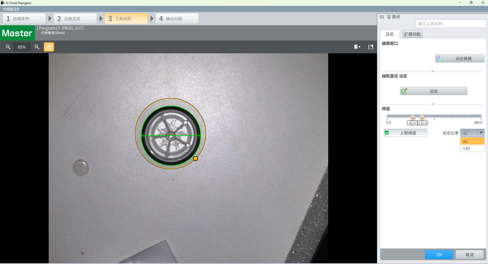 阈值调节，设定比率，只有x2和x10为什么
>  运行界面
>