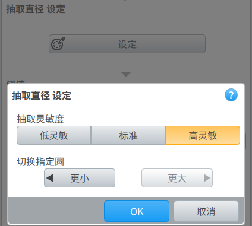
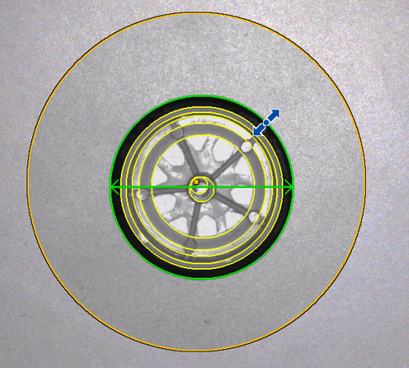
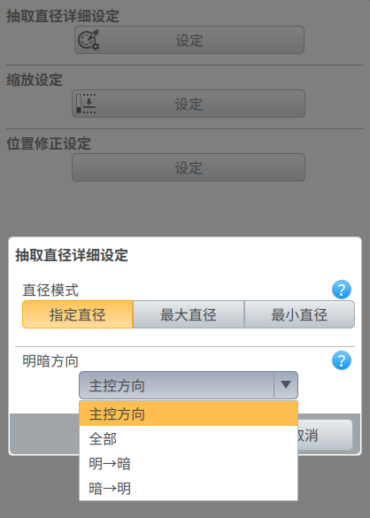
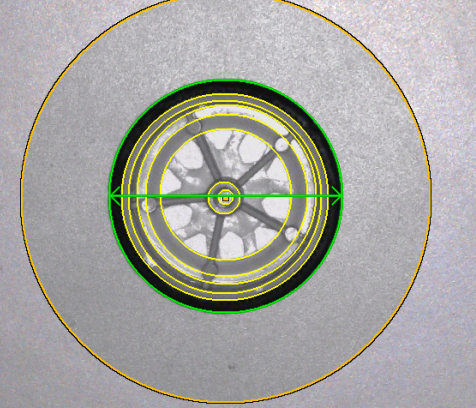
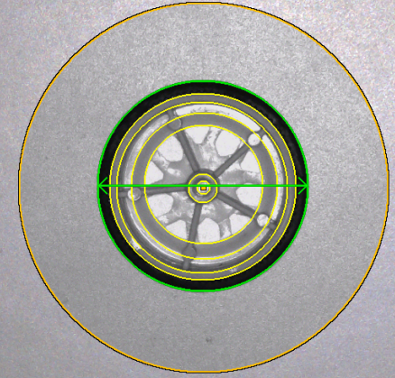
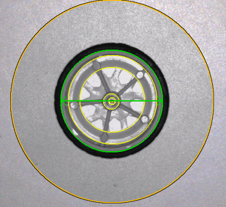
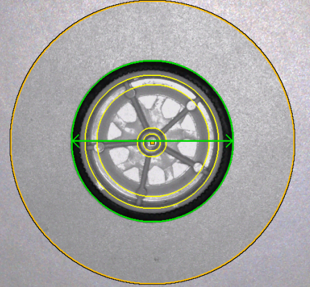

## 1. 基恩士「IV4」直径测量功能拆解

* **1.1 功能说明：**  
  在指定检测区域内提取目标的圆形边缘，计算其直径值，并将结果与设定阈值进行比较，输出 OK / NG 判定结果。

  * **工作流程概览：**
    * **工具设定阶段：**  
      选择工具 → 设置检测区域 → 配置检测参数 → 设置判定条件 → 测试验证 → 保存配置

    * **工具运行阶段：**  
      图像输入 → 应用检测区域 → 边缘提取 → 直径计算 → 阈值判断 → 输出结果

---

* **1.2 工具设定的核心概念：**

  * **「抽取直径」（设定选项）**
    * **作用：**  
      在检测到多个候选圆形轮廓时，用于决定最终用于输出计算的目标圆。
    * **可选灵敏度：中 低 高**
      不同灵敏度能提取出的边缘数量不同
    * **可选模式：**
      * **最大直径：** 选择检测区域内直径最大的圆  
      * **最小直径：** 选择检测区域内直径最小的圆  
      * **指定直径：** 手动选定其中一个圆
    * **使用场景：**
      * 同一ROI内存在多个孔位 / 多个环形结构 / 多重边缘干扰时必须配置

    <div style="display: flex; justify-content: center; gap: 12px;">
      
      
    </div>

---

* **「抽取直径-明暗方向」（扩展设定）**
  * **作用：**  
      定义圆边缘提取时的亮度变化方向，用于确定边缘搜索的极性与响应方式。

  * **方向定义（基于ROI与主控图像）：**
    * **明 → 暗：** 从亮区域向暗区域进行边缘检测（适用于亮背景+暗目标边界）
    * **暗 → 明：** 从暗区域向亮区域进行边缘检测（适用于暗背景+亮目标边界）
    * **全部：** 不限定极性，对双边或复杂边界进行统一检测（可能增加误检概率）

  * **「主控方向」说明：**
    * **定义：**  
        主控方向是算法在进行边缘搜索时所依赖的空间扫描基准方向，用于约束ROI内的采样路径与搜索优先级。
    * **理解方式：**  
        可理解为“算法默认从哪个方向开始观察与扫描边缘”，属于几何搜索层面的控制参数，而非图像亮度层面的参数。
    * **作用：**
      * 决定边缘检测在ROI中的扫描顺序（例如由外向内或由内向外）
      * 与明暗方向组合后共同决定最终边缘响应的选取结果
    * **本质关系：**
      * 明暗方向 → 控制“像素灰度变化判定逻辑”
      * 主控方向 → 控制“空间搜索路径与方向优先级”
    
    <div style="display: flex; gap: 10px; align-items: stretch;">
      
      
      
      
    </div>
    
---

* **「缩放设定」**
  * **作用：**  
      将基准图像中提取到的像素直径（默认以100为基准）映射为实际物理单位（mm / μm 等），用于工程输出。
  * **本质：**  
      像素尺度 → 物理尺度的标定转换

---

* **「阈值设定」**
  * **作用：**  
      用于直径测量结果的 OK / NG 判定范围控制。
  * **判定逻辑：**
    * 上限值：允许的最大直径
    * 下限值：允许的最小直径
  * **补充说明：**
    * 若启用「缩放设定」，则阈值基于换算后的物理单位进行比较
    * 未启用缩放时，阈值基于像素单位

---

* **1.3 工具特点：**
  * **无学习机制工具：**  
    不依赖训练样本，基于规则与边缘检测算法直接计算结果
  * **基准依赖性强：**  
    ROI设定与主控图像质量直接影响检测稳定性
  * **筛选逻辑灵活：**  
    支持多目标候选圆的规则筛选（最大/最小/指定）
  * **工程参数驱动：**  
    输出结果完全由阈值与缩放标定决定

---

* **1.4 未完全理解点：**
  * **「明暗方向」中的主控方向如何理解？**

## 2. 交互时序与算法数据流剖析

### 2.1 核心角色及动作集定义

<!-- #### 2.1.1 通信与执行动作 -->

* **A1：[上位机：更新内部参数缓存]** —— 仅更新上位机本地内存配置，不触发任何通信
* **A2：[上位机：下发参数配置]** —— 上位机将参数打包成 JSON 发送至下位机
* **A3：[上位机：发起单次触发]** —— 上位机发送指令要求下位机执行一次 `process`
* **B1：[下位机：更新运行参数]** —— 接收 JSON 报文，更新内存中 `priv` 结构体的配置
* **B2：[下位机：调用算法执行]** —— 调度底层图像引擎进行找边与匹配，生成结果数据集

* **C1：[上位机：渲染运行结果1]** —— 画面仅渲染唯一的选定基准圆（含圆心）及 ROI 区域，保持界面整洁
* **C2：[上位机：渲染运行结果2]** —— 画面显示所有提取到的候选圆（黄色虚线），并高亮当前选定的基准圆（绿色实线）

#### 2.2.1 设定阶段：框选 ROI

* **用户动作**：在画布框选环形 ROI，释放鼠标
* **执行链条**：
  1. **A1：[上位机：更新内部参数缓存]**
  2. **A2：[上位机：下发参数配置]**
  3. **B1：[下位机：更新运行参数]**
  4. **A3：[上位机：发起单次触发]**
  5. **B2：[下位机：调用算法执行]**
  6. **C1：[上位机：渲染运行结果1]**

#### 2.2.2 设定阶段：调整“提取参数” (触发算法重跑)

* **用户动作**：在配置面板修改灵敏度或明暗方向。
* **执行链条**：
  1. **A2：[上位机：下发参数配置]**
  2. **B1：[下位机：更新运行参数]**
  3. **A3：[上位机：发起单次触发]**
  4. **B2：[下位机：调用算法执行]**
  5. **C2：[上位机：渲染运行结果2]**

#### 2.2.3 设定阶段：调整“选定规则” (手动指定/最大/最小)

* **用户动作**：用户在面板切换优选规则或在画面手动点击候选圆，并点击“确定”。
* **本地交互**：在点击确认前，上位机执行 **A1：[上位机：更新内部参数缓存]**，并在本地复用缓存数据实时触发 **C2：[上位机：渲染运行结果2]** 执行高亮切换，不触发通信。
* **确认同步**：用户点击“确定”且配置发生变更时，执行：
  1. **A2：[上位机：下发参数配置]**
  2. **B1：[下位机：更新运行参数]**
  3. **A3：[上位机：发起单次触发]** (更新算法侧选定的 ROI 索引)
  4. **C1：[上位机：渲染运行结果1]** (恢复单圆渲染)

#### 2.2.4 设定阶段：调整“业务参数” (缩放与阈值)

* **用户动作**：在面板修改物理缩放倍率或上下限阈值。
* **本地交互**：上位机执行 **A1：[上位机：更新内部参数缓存]**，不触发通信。
* **确认同步**：用户点击面板“确定”时，执行：
  1. **A2：[上位机：下发参数配置]** (同步至下位机)
  2. **B1：[下位机：更新运行参数]**
  3. **A3：[上位机：发起单次触发]**

#### 2.2.5 设定阶段：面板确认/取消 (交互终点)

* **用户动作**：点击面板“确定”或“取消”。
* **点击确认**：
  1. **A2：[上位机：下发参数配置]** (同步最终完整配方)
  2. **B1：[下位机：更新运行参数]**
  3. **A3：[上位机：发起单次触发]** (执行最后一次逻辑验证)
  4. **C1：[上位机：渲染运行结果1]** (收起面板，恢复简洁渲染)
* **点击取消**：
  1. **A2：[上位机：下发参数配置]** (回滚至进入面板前的备份参数)
  2. **B1：[下位机：更新运行参数]**
  3. **C1：[上位机：渲染运行结果1]**

#### 2.2.6 运行阶段：触发运行

* **执行链条**：
  1. **B2：[下位机：调用算法执行]**
  2. **逻辑判定**：下位机执行倍率换算与阈值卡控，打包结果报文。
  3. **C1：[上位机：渲染运行结果1]** (基于报文状态映射渲染颜色)

## 3. 上下位机通信协议 (JSON Data Contract)

根据系统底层通信框架，直径测量工具的参数下发通过 `ATool_SetParam` 指令完成，工具的测算结果通过 `Report_Result` 异步上报。

### 3.1 设定参数下发协议 (`ATool_SetParam` Payload)

当上位机执行参数下发（例如用户在面板中修改了提取规则，或点击“确定”保存固化配方时），将以下 JSON 作为指令的有效载荷发送至下位机。此结构兼容系统中现有的 `Get_AtoolUserParam` 获取格式。

```json
{
  "tool_type": "DIAMETER_TOOL",
  "pos_adjust_ref": "T00",           // 绑定的位置修正工具ID (如 T00)，若无则为空字符串 ""
  "extract_params": {
    "sensitivity": 2,                // 边缘提取灵敏度 (0:低, 1:中, 2:高)
    "polarity": 2,                   // 明暗极性 (0:白到黑, 1:黑到白, 2:全部)
    "match_mode": 2,                 // 优选模式 (0:最大直径, 1:最小直径, 2:指定直径)
    "master_radius": 250.3           // 基准圆半径 (配合 match_mode=2 使用)
  },
  "display_scale": {
    "enable": 1,                     // 缩放开关 (1:开启, 0:关闭)
    "scale_factor": 0.05             // 像素到物理单位的换算系数 (如 mm/pixel)
  },
  "threshold": {
    "lower_enable": 1,               // 下限判定开关
    "lower": 18.5,                   // 直径判定下限 (物理单位)
    "upper_enable": 1,               // 上限判定开关
    "upper": 21.5                    // 直径判定上限 (物理单位)
  },
  "regions": [                       // 支持数组以兼容框架标准
    {
      "op": "base",
      "shape": "circle",             // 标定形状必须为 circle
      "x": 640.0,
      "y": 480.0,
      "r": 300.0,                    // 环形外径
      "inner_r": 200.0               // 环形内径
    }
  ]
}
```

### 3.2 运行结果上报协议 (`Report_Result` Payload)

无论是设定阶段的单次触发调试（`Trigger_Read`）还是流水线生产阶段（`Run`），下位机测算完成后均通过 `Report_Result` 异步上报结果。直径测量工具的测算数据挂载在 `atools` 数组下的对应 `node_id` 中。

```json
{
  "res_id": 6742,
  "tot_res": {
    "status": 0,                     // 整体运行状态
    "cycle_time": 206
  },
  "atools": [
    {
      "node_id": "T01",              // 当前直径测量工具的 ID
      "status": 0,                   // 判定状态 (0:OK, -1:NG, -2:ERROR未找到圆)
      "cost_time": 15,               // 算法耗时 (ms)
      "display_value": 20.03,        // 最终计算出的直径显示值 (已应用 scale_factor)
      "matched_result": {
        "best_match_idx": 1,         // 当前选定的最优圆在候选数组中的索引 (-1 为无)
        "candidates": [              // 算法提取到的所有候选圆数组 (供上位机画面渲染及切换使用)
          {
            "id": 0,
            "x": 642.1,
            "y": 478.5,
            "r": 200.0,              // 像素半径
            "score": 88              // 边缘质量评分 (0-100)
          },
          {
            "id": 1,
            "x": 641.5,
            "y": 481.2,
            "r": 250.3,
            "score": 95
          }
        ]
      }
    }
  ]
}
```

---

## 4. 算法库接口契约 (`nvs_alg_diameter.h`)

本节定义了对应于动作 **B2：[下位机：调用算法执行]** 的底层 C 语言接口。

为了保证性能与灵活度，算法引擎设计为**全量输出模式**：它根据设定的提取规则，输出视野内所有满足基本边缘强度的候选圆。上层业务逻辑通过比对返回的 `candidates` 数组与设定的 `match_mode`，自行决定最终命中的圆。

```c
#ifndef __NVS_ALG_DIAMETER_H__
#define __NVS_ALG_DIAMETER_H__

#include "nvs_base_type.h"

#ifdef __cplusplus
extern "C" {
#endif

// ----------------------------------------------------------------------------
// 类型定义
// ----------------------------------------------------------------------------

/**
 * @brief 直径测量算法引擎句柄
 */
typedef void* nvs_alg_diameter_handle_t;

/**
 * @brief 边缘提取的明暗极性
 */
typedef enum {
    NVS_ALG_POLARITY_LIGHT_TO_DARK = 0, // 明到暗 (由内向外)
    NVS_ALG_POLARITY_DARK_TO_LIGHT = 1, // 暗到明 (由内向外)
    NVS_ALG_POLARITY_ALL           = 2  // 全部 (忽略极性)
} nvs_alg_polarity_e;

/**
 * @brief 目标圆的多候选优选模式
 */
typedef enum {
    NVS_ALG_MATCH_MAX_RADIUS     = 0, // 选择半径最大的候选圆
    NVS_ALG_MATCH_MIN_RADIUS     = 1, // 选择半径最小的候选圆
    NVS_ALG_MATCH_NEAREST_MASTER = 2  // 选择半径最接近 master_radius 的候选圆
} nvs_alg_match_mode_e;

/**
 * @brief 算法执行输入参数
 * @note 严格对应 JSON 通信协议中的 `extract_params` 节点
 */
typedef struct {
    int32_t sensitivity;             // 边缘提取灵敏度 (0:低, 1:中, 2:高)
    nvs_alg_polarity_e polarity;     // 寻边明暗极性
    nvs_alg_match_mode_e match_mode; // 优选规则 (用于指导 best_match_idx 的生成)
    float master_radius;             // 基准半径 (像素，仅在 NEAREST_MASTER 模式下生效)
} nvs_alg_diameter_param_t;

/**
 * @brief 单个候选圆的特征描述
 */
typedef struct {
    int32_t id;                      // 候选圆内部追踪序号
    nvs_circle_t circle_geom;        // 几何参数 (包含 x, y 坐标与半径 r)
    int32_t score;                   // 边缘拟合质量评分 (0-100，分数越高边缘越清晰)
    nvs_alg_polarity_e act_polarity; // 算法实际探测到的该边缘的极性
} nvs_alg_candidate_circle_t;

// 限制单次提取的最大候选圆数量，防止内存爆炸
#define NVS_ALG_DIAMETER_MAX_CANDIDATES 8 

/**
 * @brief 算法引擎单次测算的完整输出结果集
 */
typedef struct {
    int32_t num_candidates;          // 实际提取到的合规候选圆数量
    nvs_alg_candidate_circle_t candidates[NVS_ALG_DIAMETER_MAX_CANDIDATES]; 
    int32_t best_match_idx;          // 依据 param.match_mode 计算出的最优解在数组中的索引 (若无则为 -1)
} nvs_alg_diameter_result_t;
---

* **「抽取直径-明暗方向」（扩展设定）**
  * **作用：**  
      定义圆边缘提取时的亮度变化方向，用于确定边缘搜索的极性与响应方式。

  * **方向定义（基于ROI与主控图像）：**
    * **明 → 暗：** 从亮区域向暗区域进行边缘检测（适用于亮背景+暗目标边界）
    * **暗 → 明：** 从暗区域向亮区域进行边缘检测（适用于暗背景+亮目标边界）
    * **全部：** 不限定极性，对双边或复杂边界进行统一检测（可能增加误检概率）

  * **「主控方向」说明：**
    * **定义：**  
        主控方向是算法在进行边缘搜索时所依赖的空间扫描基准方向，用于约束ROI内的采样路径与搜索优先级。
    * **理解方式：**  
        可理解为“算法默认从哪个方向开始观察与扫描边缘”，属于几何搜索层面的控制参数，而非图像亮度层面的参数。
    * **作用：**
      * 决定边缘检测在ROI中的扫描顺序（例如由外向内或由内向外）
      * 与明暗方向组合后共同决定最终边缘响应的选取结果
    * **本质关系：**
      * 明暗方向 → 控制“像素灰度变化判定逻辑”
      * 主控方向 → 控制“空间搜索路径与方向优先级”

---

* **「缩放设定」**
  * **作用：**  
      将基准图像中提取到的像素直径（默认以100为基准）映射为实际物理单位（mm / μm 等），用于工程输出。
  * **本质：**  
      像素尺度 → 物理尺度的标定转换

---

* **「阈值设定」**
  * **作用：**  
      用于直径测量结果的 OK / NG 判定范围控制。
  * **判定逻辑：**
    * 上限值：允许的最大直径
    * 下限值：允许的最小直径
  * **补充说明：**
    * 若启用「缩放设定」，则阈值基于换算后的物理单位进行比较
    * 未启用缩放时，阈值基于像素单位

---

* **1.3 工具特点：**
  * **无学习机制工具：**  
    不依赖训练样本，基于规则与边缘检测算法直接计算结果
  * **基准依赖性强：**  
    ROI设定与主控图像质量直接影响检测稳定性
  * **筛选逻辑灵活：**  
    支持多目标候选圆的规则筛选（最大/最小/指定）
  * **工程参数驱动：**  
    输出结果完全由阈值与缩放标定决定

---

* **1.4 未完全理解点：**
  * **「明暗方向」中的主控方向如何理解？**

## 2. 交互与状态机流转

### 2.1 工具状态定义 (Lifecycle)

工具在下位机侧维护三种核心状态，决定了 UI 的可操作权限和产线的运行逻辑：

* **INIT (未设定):** 工具刚被添加到系统，缺乏基准参数。此时**强拦截**切入运行模式，且向外输出的状态强制为 NG。
* **TEACH_OK (设定成功):** 用户成功执行了“设定”动作，底层的极性和基准半径已成功注册，允许切入运行模式。
* **TEACH_NG (设定失败):** 用户执行了“设定”，但算法在当前 ROI 内找不到合格的圆。系统停留在设定态，UI 报警并置灰保存/运行按钮。

### 2.2 设定阶段 (Teach Mode) 动作流转

1. **参数透传:** UI 端拖拽环形 ROI（内径、外径、圆心）并选择模式（最大/最小/指定圆），参数实时透传给下位机。
2. **探测触发 (Probe):** 用户点击“设定”按钮。下位机冻结当前图像，调用算法的 Probe 接口。
3. **特征注册 (核心防呆):** * 若选择“主控方向”，算法计算并返回真实极性（0 或 1），下位机将其覆写为绝对极性并**锁死**。
    * 若选择“指定圆”，下位机将算法返回的圆半径记录为 `master_radius`，作为运行期比对的锚点。
4. **物理标定 (可选):** 用户输入实际物理尺寸 (mm)，下位机计算标定系数：`Scale Factor = 物理输入值 / 基准像素直径`。若不开启标定，`Scale Factor = 1.0`。

### 2.3 运行阶段 (Run Mode) 动作流转

1. **位置补偿:** 接收新一帧图像。若配置了前置“位置修正”工具，下位机需先将基准 ROI 的坐标乘以仿射变换矩阵，计算出当前帧的实际 ROI 坐标。
2. **算法执行:** 下位机将偏移后的 ROI 及设定的极性、模式参数下发给算法执行找圆。
3. **业务卡控:** * 下位机获取算法返回的原始像素直径。
    * 计算实际输出值：`Display Value = 像素直径 * Scale Factor`。
    * 执行判定：若 `Limit_LO <= Display Value <= Limit_HI`，状态置为 OK；否则置为 NG。
    * 打包结果向上位机/PLC 抛出。

---

## 3. UI 渲染与可视化 (Canvas)

为确保视觉反馈的直观性，上下位机需遵循以下画布重绘契约：

### 3.1 设定态图形渲染

* **环形搜索框 (ROI):** 渲染为半透明颜色填充区（如浅蓝），带有可交互的内径、外径及圆心拖拽锚点。超出此区域的图像不参与运算。

### 3.2 运行态图形渲染

* **结果圆拟合边界:** 沿算法输出的 `(X, Y, Radius)` 绘制圆廓。
  * 判定为 OK: 渲染为绿色 (如 `#00FF00`)。
  * 判定为 NG: 渲染为红色 (如 `#FF0000`)。
* **圆心准星:** 在算法拟合的圆心位置 `(X, Y)` 绘制十字准星。
* **直径辅助线:** 跨越圆心绘制一条直线段，两端触及圆周边界，直观展示测量的物理跨度。颜色与“结果圆”保持状态一致。

### 3.3 数据看板反馈

* **主视窗悬浮:** 实时展示 `Display Value`（带单位 % 或 mm）。
* **公差滑块:** 红绿相间的分段条，中间绿色区域映射为 `Limit_LO` 至 `Limit_HI`，当前测量值以光标形式在条带上实时滑动。

// ----------------------------------------------------------------------------
// API 接口声明
// ----------------------------------------------------------------------------

/**
 * @brief 创建直径测量算法引擎实例
 * @return 成功返回引擎句柄，失败返回 NULL
 */
nvs_alg_diameter_handle_t nvs_alg_diameter_create(void);

/**
 * @brief 销毁引擎实例并释放内存
 * @param handle 引擎句柄
 */
void nvs_alg_diameter_destroy(nvs_alg_diameter_handle_t handle);

/**
 * @brief 设置测算的环形 ROI 区域
 * @param handle 引擎句柄
 * @param regions ROI 数组 (通常只取 index 0 的 NVS_SHAPE_CIRCLE 类型的 region)
 * @param region_num 区域数量
 * @return NVS_OK 成功，其他值为错误码
 */
int32_t nvs_alg_diameter_set_region(nvs_alg_diameter_handle_t handle, const nvs_region_t *regions, int32_t region_num);

/**
 * @brief 设置测算的提取规则与优选参数
 * @param handle 引擎句柄
 * @param param 参数结构体指针
 * @return NVS_OK 成功，其他值为错误码
 */
int32_t nvs_alg_diameter_set_param(nvs_alg_diameter_handle_t handle, const nvs_alg_diameter_param_t *param);

/**
 * @brief 执行单次图像直径测量
 * @param handle 引擎句柄
 * @param img 输入的图像数据帧 (已完成全局位置补偿)
 * @param result 输出的结果集指针
 * @return NVS_OK 测算成功，其他值为错误码
 */
int32_t nvs_alg_diameter_run(nvs_alg_diameter_handle_t handle, const nvs_image_t *img, nvs_alg_diameter_result_t *result);

#ifdef __cplusplus
}
#endif

#endif // __NVS_ALG_DIAMETER_H__
```

# ifdef __cplusplus
}
# endif

# endif // **NVS_ALG_DIAMETER_H**

```

## 5. 下位机工具节点设定 (`nvs_diameter_tool.c`)

### 5.1 私有数据结构 (`priv`)

```c
typedef struct {
    char prog_id_str[NVS_PROG_MAX_ID_LEN];
    char pos_adjust_id[NVS_NODE_MAX_NAME_LEN]; 
    
    // 算法参数透传与设定缓存
    nvs_alg_diameter_param_t alg_params; 
    int32_t target_candidate_idx;    // 缓存上位机下发的候选圆 ID
    
    // 显示倍率 (缩放)
    int32_t scale_enable;
    float scale_factor;
    
    // 阈值判定开关与数值
    int32_t limit_lower_enable;
    int32_t limit_upper_enable;
    nvs_threshold_t threshold;       // 复用框架内的上下限结构
    
    // 区域管控
    nvs_region_t base_roi;           
    nvs_region_t adjust_roi;         
    int32_t region_count;            
    nvs_region_t other_roi[MAX_REGIONS];
    
    // 算法引擎句柄
    nvs_alg_diameter_handle_t algo_ctx;
    
    // 运行时结果暂存
    nvs_alg_diameter_result_t out_res;
    int32_t cost_time;
} nvs_diameter_priv_t;
```

### 5.2 核心业务逻辑实现卡点 (`ops.process`)

收到 Trigger Read 信号后，框架调度 `process` 接口，执行以下卡点：

1. **环形 ROI 位置修正校验:**
   调用仿射变换接口偏移 `base_roi`。确保底层仿射函数对 `NVS_SHAPE_CIRCLE` 仅平移圆心 `(x, y)`，严禁缩放内外径。
2. **纯透传与算法执行:**
   调用 `nvs_alg_diameter_set_param(priv->algo_ctx, &priv->alg_params);`，随后调用 `nvs_alg_diameter_run`。
   * *防呆拦截：* 若 `priv->out_res.num_candidates == 0` 或 `best_match_idx == -1`，直接输出 `NVS_OUTPUT_ERR` 并跳出。
3. **设定态动态覆写 (Teach 特殊逻辑):**
   若当前是在执行设定，且上位机下发了合法的 `target_candidate_idx`，下位机需在此处执行拦截：
   `priv->alg_params.master_radius = priv->out_res.candidates[target_candidate_idx].circle_geom.r;`，并保存配方。
4. **倍率换算与双限卡控:**

   ```c
   // 1. 获取最终胜出圆的像素直径
   int32_ate_circle_t candidates[NVS_ALG_MAX_CANDIDATE_CIRCLES]; // 候选圆数组
    
    int32_t best_match_idx;          // 依据 match_mode 选出的最终目标索引 (-1 表示无符合规则的目标)

} nvs_alg_diameter_result_t;

// ---------------- 算法接口定义 ----------------
// 创建与销毁
nvs_alg_diameter_handle_t nvs_alg_diameter_create(void);
void nvs_alg_diameter_destroy(nvs_alg_diameter_handle_t handle);

// 参数与 ROI 配置
int32_t nvs_alg_diameter_set_param(nvs_alg_diameter_handle_t handle, const nvs_alg_diameter_param_t *param);
int32_t nvs_alg_diameter_set_region(nvs_alg_diameter_handle_t handle, const nvs_region_t*regions, int32_t region_num);

// 执行测算
int32_t nvs_alg_diameter_run(nvs_alg_diameter_handle_t handle, const nvs_image_t *img, nvs_alg_diameter_result_t*result);

# ifdef __cplusplus
}
# endif

# endif // __NVS_ALG_DIAMETER_H__t best_idx = priv->out_res.best_match_idx;
   float pixel_diameter = priv->out_res.candidates[best_idx].circle_geom.r * 2.0f;
   float final_value = pixel_diameter;

   // 2. 显示倍率换算
   if (priv->scale_enable) {
       final_value = pixel_diameter * priv->scale_factor;
   }

   // 3. 执行独立阈值判定 (假设扩大 1000 倍进行整型比较)
   int32_t cmp_val = (int32_t)(final_value * 1000);
   int32_t status = NVS_OUTPUT_OK; // 默认状态为 OK

   if (priv->limit_lower_enable && cmp_val < priv->threshold.lower) {
       status = NVS_OUTPUT_NG;
   }
   if (priv->limit_upper_enable && cmp_val > priv->threshold.upper) {
       status = NVS_OUTPUT_NG;
   }

   ```

5. **组装 JSON 返回:**
   将计算好的 `display_value`、最终 `status` 以及包含所有 `candidates` 数组的结构树打包，通过 `nvs_node_usr_res_set_ptr` 发给上位机。


