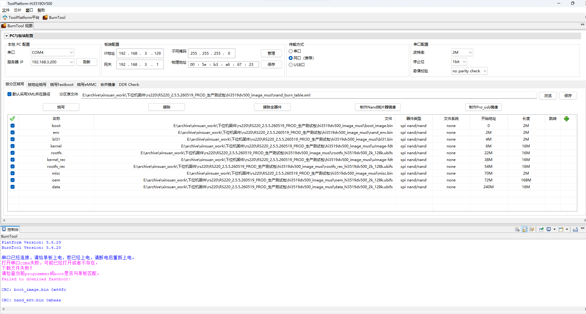

## ref

- [流程参考](http://172.18.1.12/wiki/spaces/RJKF/pages/NuY6s3AX)

## 项目链接

```bash
http://192.168.10.10/xssw/products/reader-product-repo/-/blob/main/rs220_240w_new_one_click.xml?ref_type=heads
软件分支：rs220-taiji
```

## clone 编译流程

```bash
# 仓库初始化
repo init -u http://192.168.10.10/xssw/products/reader-product-repo --no-clone-bundle
# 拉取相关分支代码
repo init -m rs220_240w_new_one_click.xml
# 同步工作区中的所有仓库到最新的提交
repo sync 
# 为本地分支取别名
# repo start XXXXX --all 
```

## 烧写大包



```bash
最关键是波特率选择：2M
选择xml后，点击烧写，日志会弹出要求插拔电源一次
烧写重启后，ifconfig内容
~ # ifconfig
eth0      Link encap:Ethernet  HWaddr 9A:02:E7:68:E9:30
          inet addr:192.168.10.129  Bcast:192.168.10.255  Mask:255.255.255.0
          inet6 addr: fe80::9802:e7ff:fe68:e930/64 Scope:Link
          UP BROADCAST RUNNING ALLMULTI MULTICAST  MTU:1500  Metric:1
          RX packets:87 errors:0 dropped:4 overruns:0 frame:0
          TX packets:29 errors:0 dropped:0 overruns:0 carrier:0
          collisions:0 txqueuelen:1000
          RX bytes:10269 (10.0 KiB)  TX bytes:2651 (2.5 KiB)
          Interrupt:39

```
